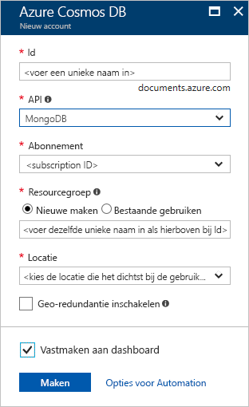
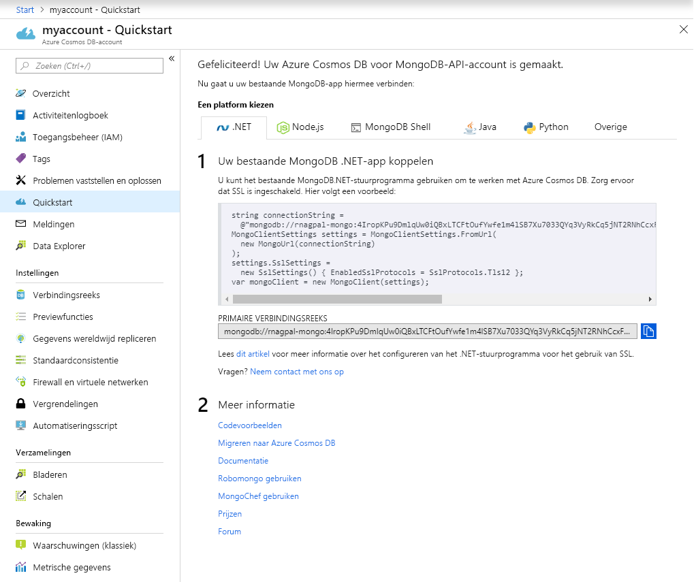

1. Meld u in een nieuw venster aan bij [Azure Portal](https://portal.azure.com/).
2. Klik in het menu links op **Een resource maken**, klik op **Databases** en klik vervolgens onder **Azure Cosmos DB** op **Maken**.
   
   

3. Voer op de pagina **Azure Cosmos DB-account maken** de instellingen in voor het nieuwe Azure Cosmos DB-account. 
 
    Instelling|Waarde|Beschrijving
    ---|---|---
    Abonnement|Uw abonnement|Selecteer het Azure-abonnement dat u voor dit Azure Cosmos DB-account wilt gebruiken. 
    Resourcegroep|Nieuwe maken  Voer de unieke naam in die u in ID hebt opgegeven|Selecteer **Nieuw maken**. Voer daarna een nieuwe resourcegroepnaam in voor het account. Gebruik voor het gemak dezelfde naam als uw id. 
    Accountnaam|Voer een unieke naam in|Voer een unieke naam in om uw Azure Cosmos DB-account te identificeren. Gebruik een unieke id omdat *documents.azure.com* is toegevoegd aan de id die u hebt opgegeven om uw URI te maken.  De id mag alleen kleine letters, cijfers en het koppelteken (-) bevatten. De id moet tussen de 3 en 31 tekens lang zijn.
    API|Azure Cosmos DB-API voor MongoDB|De API bepaalt het type te maken account. Azure Cosmos DB heeft vijf API's: Core(SQL) voor documentdatabases, Gremlin voor grafiekdatabases, de API van Azure Cosmo DB, MongoDB voor documentdatabases, Azure Table en Cassandra. Op dit moment moet u voor elke API een afzonderlijk account maken.   Selecteer **MongoDB** omdat u in deze quickstart een tabel maakt die geschikt is voor de MongoDB.|
    Locatie|Selecteer de regio het dichtst in de buurt van uw gebruikers|Selecteer een geografische locatie waar u het Azure Cosmos DB-account wilt hosten. Gebruik de locatie die zich het dichtst bij uw gebruikers bevindt, zodat ze de snelst mogelijke toegang tot de gegevens hebben.

    Selecteer **Beoordelen en maken**. U kunt de secties **Netwerk** en **Tags** overslaan. 

    

4. Het duurt enkele minuten om het account te maken. Wacht tot de portal de pagina **Gefeliciteerd! Uw Cosmos-account met compatibiliteit voor het wire-protocol voor MongoDB is gereed** weergeeft.

    
