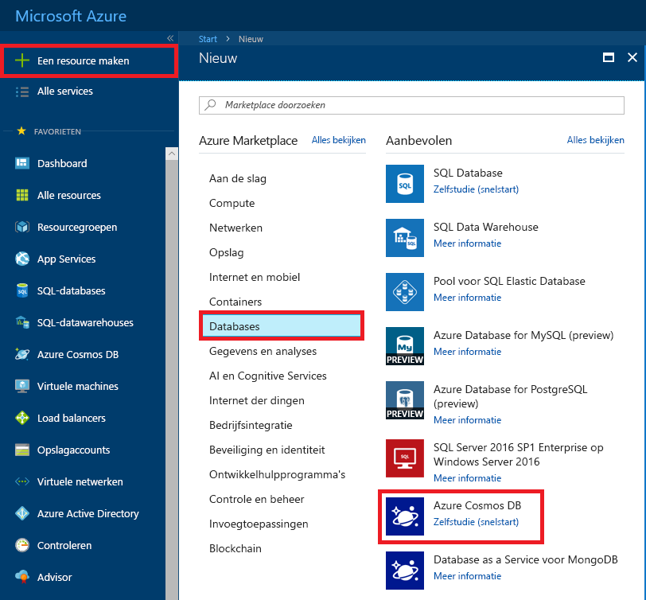
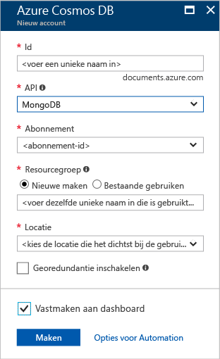
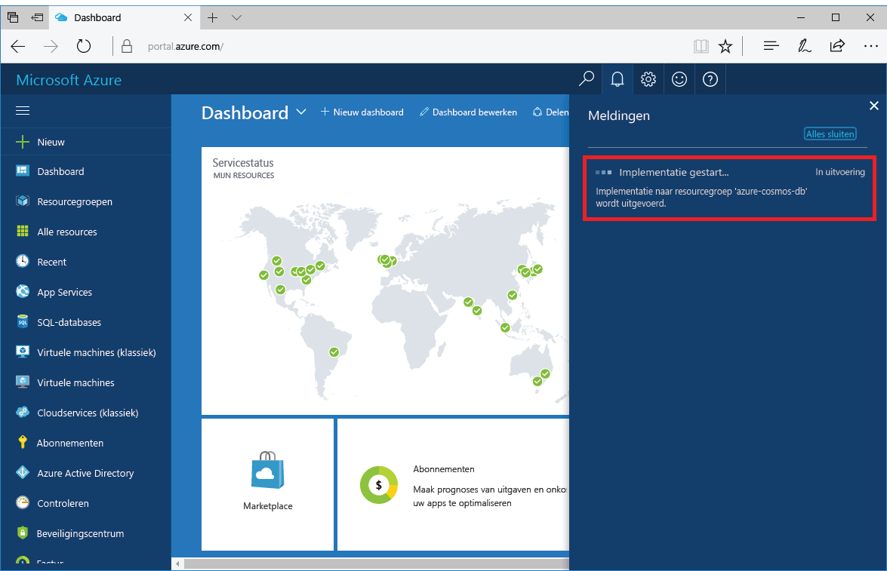
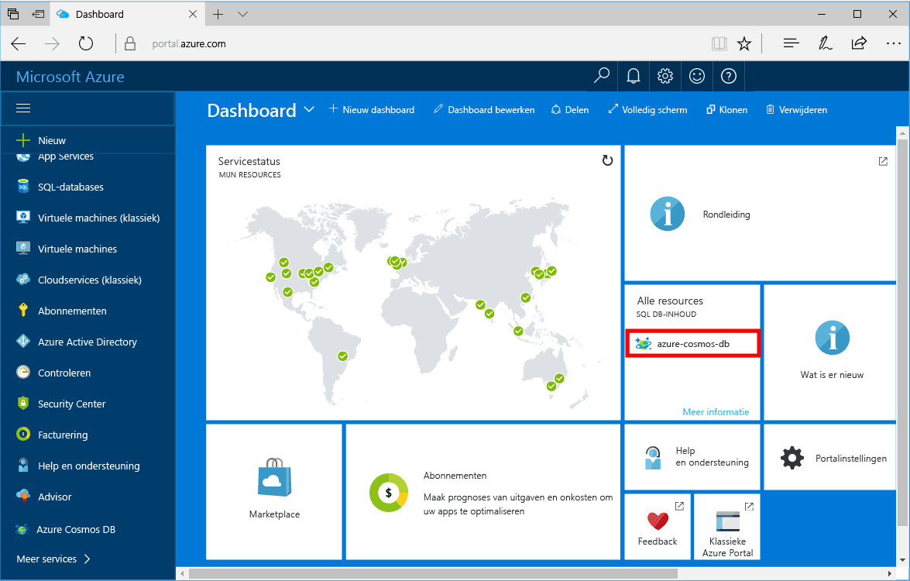

1. Meld u in een nieuw venster aan bij [Azure Portal](https://portal.azure.com/).
2. Klik in het menu links op **Een resource maken**, klik op **Databases** en klik vervolgens onder **Azure Cosmos DB** op **Maken**.
   
   

3. Geef op de blade **Nieuw account** **MongoDB** op als de API en voer de gewenste configuratiegegevens in voor het Azure Cosmos DB-account.
 
    

    * **Id** moet een unieke naam zijn voor het Azure Cosmos DB-account. De id mag alleen kleine letters, cijfers en het minteken ('-') bevatten, en moet tussen de 3 en 50 tekens lang zijn.
    * Bij **Abonnement** wordt automatisch uw Azure-abonnement ingevuld.
    * **Resourcegroep** verwijst naar de naam van de resourcegroep voor uw Azure Cosmos DB-account.
    * **Locatie** is de geografische locatie van uw exemplaar van Azure Cosmos DB. Kies de locatie die het dichtst bij uw gebruikers is.

4. Klik op **Maken** om het account te maken.
5. Klik op de werkbalk op **Meldingen** om het implementatieproces te bewaken.

    

6.  Als de implementatie is voltooid, opent u het nieuwe account via de tegel Alle resources. 

    
