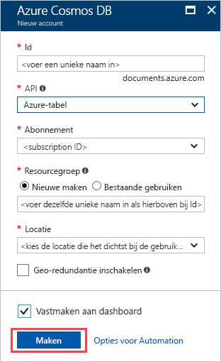
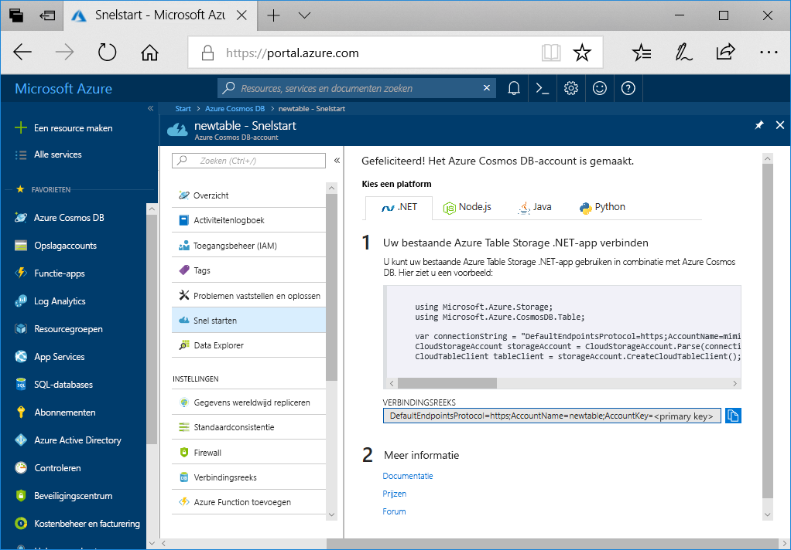

1. Meld u in een nieuw browservenster aan bij [Azure Portal](https://portal.azure.com/).
2. Selecteer in het navigatiedeelvenster links **een resource maken**. Selecteer **Databases** en selecteer vervolgens **Azure Cosmos DB**.
   
   

3. Op de **Create Azure Cosmos DB Account** pagina, geef de instellingen voor de nieuwe Azure Cosmos DB-account:
 
    Instelling|Waarde|Description
    ---|---|---
    Abonnement|Uw abonnement|Selecteer het Azure-abonnement dat u voor dit Azure Cosmos DB-account wilt gebruiken. 
    Resourcegroep|Nieuwe maken  Voer de unieke naam in die u in ID hebt opgegeven|Selecteer **Nieuw maken**. Voer vervolgens een nieuwe Resourcegroepnaam voor uw account. Gebruik voor het gemak dezelfde naam als uw id. 
    Accountnaam|Voer een unieke naam in|Voer een unieke naam in om uw Azure Cosmos DB-account te identificeren.  De id mag alleen kleine letters, cijfers en het koppelteken (-) bevatten. Het moet tussen 3 en 31 tekens lang zijn.
    API|Azure Table|De API bepaalt het type te maken account. Azure Cosmos DB heeft vijf API's: Core(SQL) voor documentdatabases, Gremlin voor grafiekdatabases, MongoDB voor documentdatabases, Azure Table en Cassandra. Op dit moment moet u voor elke API een afzonderlijk account maken.   Selecteer **Azure Table** omdat in deze quickstart maakt u een tabel die geschikt is voor de Table-API.   [Meer informatie over de Table-API](../articles/cosmos-db/table-introduction.md).|
    Locatie|Selecteer de regio het dichtst in de buurt van uw gebruikers|Selecteer een geografische locatie waar u het Azure Cosmos DB-account wilt hosten. Gebruik de locatie die zich het dichtst bij uw gebruikers zodat ze de snelst mogelijke toegang tot gegevens.

    U kunt laten de **Geo-redundantie** en **meerdere regio's schrijft** opties de standaardwaarden (**uitschakelen**) om aanvullende RU-kosten te voorkomen. U kunt overslaan de **netwerk** en **Tags** secties.

5. Selecteer **Beoordelen en maken**. Nadat de validatie voltooid is, selecteert u **maken** om het account te maken. 
 
   

6. Het duurt een paar minuten om het account te maken. U ziet een bericht waarin wordt vermeld **uw implementatie wordt uitgevoerd**. Wacht tot de implementatie voltooid en selecteer vervolgens **naar de resource gaan**.

    
