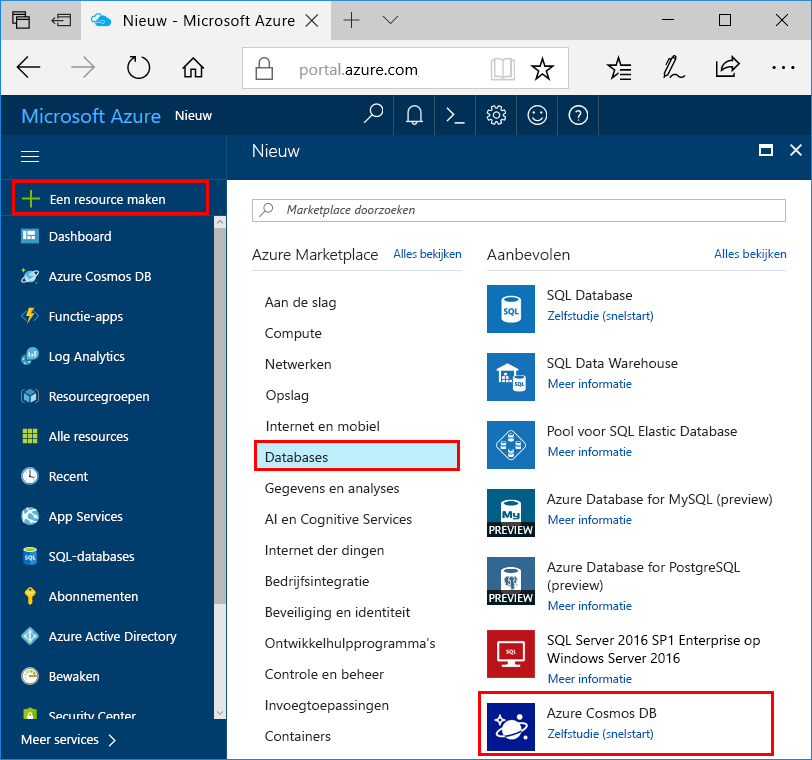
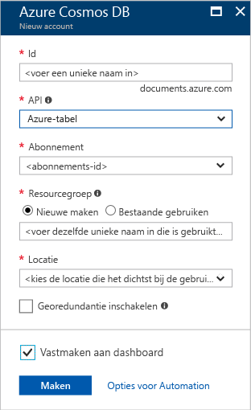

1. Meld u in een nieuw venster aan bij [Azure Portal](https://portal.azure.com/).
2. Klik in het menu links op **Nieuw**, klik op **Databases** en klik vervolgens onder **Azure Cosmos DB** op **Maken**.
   
   

3. Geef op de blade **Nieuw account** de gewenste configuratie op voor het Azure Cosmos DB-account. 

    Met Azure Cosmos DB kunt u een van de vier programmeermodellen kiezen: Gremlin (Graph), MongoDB, SQL (DocumentDB) en Tabel (sleutelwaarde). 
    
    In deze Quick Start programmeren we met de tabel-API, daarom kiest u bij het invullen van het formulier voor **Tabel (sleutelwaarde)**. Maar als u grafiekgegevens voor een sociale media-app hebt, documentgegevens uit een catalogus-app, of gegevens die zijn gemigreerd uit een MongoDB-app, moet u er rekening mee houden dat Azure Cosmos DB een zeer beschikbare, globaal gedistribueerd databaseserviceplatform kan bieden voor alle bedrijfskritische toepassingen.

    Vul de blade Nieuw account in en gebruik de gegevens in de schermopname hierbij als richtlijn. Wanneer u het account instelt, kiest u unieke waarden, zodat deze niet precies overeenkomen met de waarden in de schermopname. 
 
    

    Instelling|Voorgestelde waarde|Beschrijving
    ---|---|---
    Id|*Unieke waarde*|Een unieke naam die u kiest om het Azure Cosmos DB-account aan te duiden. *documents.azure.com* is toegevoegd aan de id die u hebt opgegeven om uw URI te maken. Gebruik daarom een unieke maar identificeerbare id. De id mag alleen kleine letters, cijfers en het minteken ('-') bevatten, en moet tussen de 3 en 50 tekens lang zijn.
    API|Tabel (sleutelwaarde)|Verderop in dit artikel gaan we programmeren met de [Tabel-API](../articles/cosmos-db/table-introduction.md).|
    Abonnement|*Uw abonnement*|Het Azure-abonnement dat u wilt gebruiken voor het Azure Cosmos DB-account. 
    Resourcegroep|*Dezelfde waarde als id*|De nieuwe resourcegroepnaam voor het account. Gebruik dezelfde naam als uw id om het uzelf gemakkelijk te maken. 
    Locatie|*De regio het dichtst bij uw gebruikers*|De geografische locatie waar u het Azure Cosmos DB-account gaat hosten. Kies de locatie die zich het dichtst bij uw gebruikers bevindt, zodat ze de snelst mogelijke toegang tot de gegevens hebben.   

4. Klik op **Maken** om het account te maken.
5. Klik op de werkbalk op **Meldingen** om het implementatieproces te bewaken.

    

6.  Als de implementatie is voltooid, opent u het nieuwe account via de tegel Alle resources. 

    
