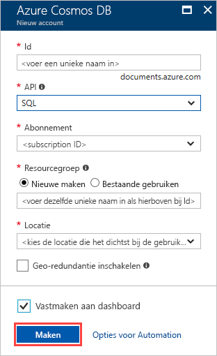

1. Meld u in een nieuw browservenster aan bij [Azure Portal](https://portal.azure.com/).
2. Klik op **Een resource maken** > **Databases** > **Azure Cosmos DB**.
   
   

3. Voer op de pagina **Nieuw account** de instellingen in voor het nieuwe Azure Cosmos DB-account. 
 
    Instelling|Waarde|Beschrijving
    ---|---|---
    Id|*Voer een unieke naam in*|Voer een unieke naam in om dit Azure Cosmos DB-account te identificeren. Omdat *documents.azure.com* is toegevoegd aan de id die u hebt opgegeven om uw URI te maken, gebruikt u een unieke maar identificeerbare id.  De id mag alleen kleine letters, cijfers en het koppelteken (-) bevatten en moet 3 tot 50 tekens lang zijn.
    API|SQL|De API bepaalt het type te maken account. Azure Cosmos DB biedt vijf API's die aansluiten bij de behoeften van uw toepassing: SQL (documentdatabase), Gremlin (grafiekdatabase) MongoDB (documentdatabase), Azure Table en Cassandra. Momenteel is voor elke API een afzonderlijk account nodig.   Selecteer **SQL**, omdat u in deze snelstart een documentdatabase maakt waarop query's kunnen worden uitgevoerd met behulp van SQL-syntaxis en die toegankelijk is met de SQL-API.  [Meer informatie over de SQL-API](../articles/cosmos-db/documentdb-introduction.md)|
    Abonnement|*Uw abonnement*|Selecteer het Azure-abonnement dat u wilt gebruiken voor dit Azure Cosmos DB-account. 
    Resourcegroep|Nieuwe maken  *Geef dezelfde unieke naam op zoals hierboven bij id*|Selecteer **Nieuwe maken** en voer een naam voor de nieuwe resourcegroep voor uw account in. Gebruik dezelfde naam als uw id om het uzelf gemakkelijk te maken. 
    Locatie|*Selecteer de regio die het dichtst bij uw gebruikers is gelegen*|Selecteer de geografische locatie waar u het Azure Cosmos DB-account gaat hosten. Gebruik de locatie die zich het dichtst bij uw gebruikers bevindt, zodat ze de snelst mogelijke toegang tot de gegevens hebben.
    Georedundantie inschakelen| Leeg laten | Hiermee maakt u een gerepliceerde versie van uw database in een tweede (gekoppelde) regio. Laat dit leeg.  
    Vastmaken aan dashboard | Selecteer | Selecteer dit vakje, zodat uw nieuwe databaseaccount wordt toegevoegd aan uw portaldashboard voor eenvoudige toegang.

    Klik vervolgens op **Maken**.

    

4. Het duurt enkele minuten om het account te maken. Wacht tot de portal de pagina **Gefeliciteerd! Uw Azure Cosmos DB-account is gemaakt** weergeeft.

    

