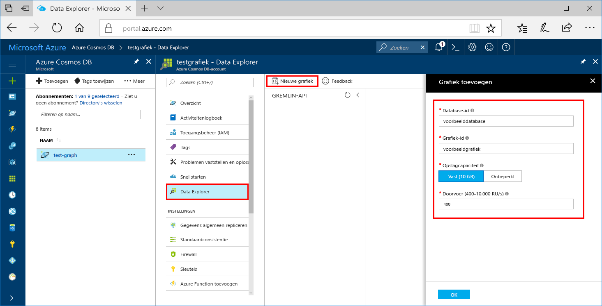

U kunt nu het hulpprogramma Data Explorer in Azure Portal gebruiken om een grafiekdatabase te maken. 

1. Klik op **Data Explorer** > **Nieuwe grafiek**.

    Uiterst rechts wordt het gebied **Grafiek toevoegen** weergegeven. Mogelijk moet u naar rechts scrollen om het te bekijken.

    

2. Geef op de pagina **Grafiek toevoegen** de instellingen voor de nieuwe grafiek op.

    Instelling|Voorgestelde waarde|Beschrijving
    ---|---|---
    Database-id|voorbeelddatabase|Voer *sample-database* in als de naam voor de nieuwe database. Databasenamen moeten tussen de 1 en 255 tekens zijn en mogen geen `/ \ # ?` bevatten of eindigen op een spatie.
    Grafiek-id|voorbeeldgrafiek|Voer *sample-graph* in als de naam voor uw nieuwe verzameling. Voor namen van grafieken gelden dezelfde tekenvereisten als voor database-id's.
    Opslagcapaciteit|Vast (10 GB)|Laat de standaardwaarde **Vast (10 GB)** staan. Deze waarde is de opslagcapaciteit van de database.
    Doorvoer|400 RU‘s|Wijzig de doorvoer in 400 aanvraageenheden per seconde (RU/s). U kunt de doorvoer later opschalen als u de latentie wilt beperken.

3. Zodra het formulier is ingevuld, klikt u op **OK**.
