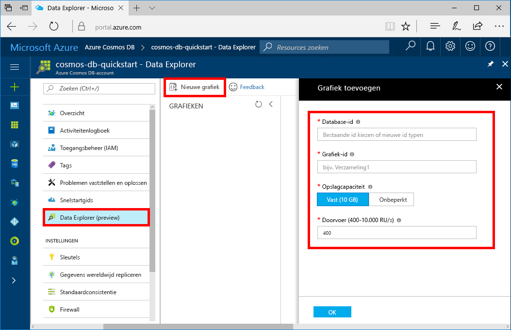

U kunt nu het hulpprogramma Data Explorer in Azure Portal gebruiken om een grafiekdatabase te maken. 

1. Selecteer in het menu aan de linkerkant van de Azure Portal **Data Explorer (Preview)**.

2. Onder **Data Explorer (Preview)**, selecteer **nieuwe grafiek**. Vul vervolgens de pagina met behulp van de volgende informatie:

    

    Instelling|Voorgestelde waarde|Beschrijving
    ---|---|---
    Database-id|voorbeelddatabase|Voer *sample-database* in als de naam voor de nieuwe database. Databasenaam moet tussen 1 en 255 tekens en mag niet `/ \ # ?` of een spatie.
    Graaf-id|voorbeeldgrafiek|Voer *sample-graph* in als de naam voor uw nieuwe verzameling. Voor namen van grafieken gelden dezelfde tekenvereisten als voor database-id's.
    Opslagcapaciteit| 10 GB|Laat de standaardwaarde staan. Dit is de opslagcapaciteit van de database.
    Doorvoer|400 RU‘s|Laat de standaardwaarde staan. U kunt de doorvoer later opschalen als u de latentie wilt beperken.

3. Nadat het formulier is ingevuld, selecteert u **OK**.
