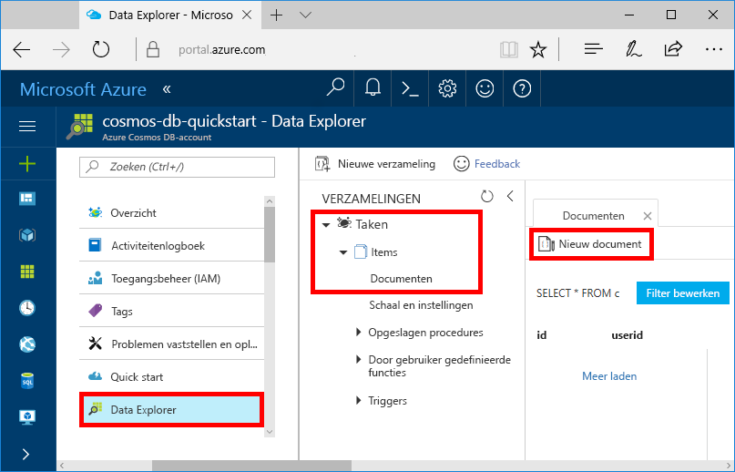
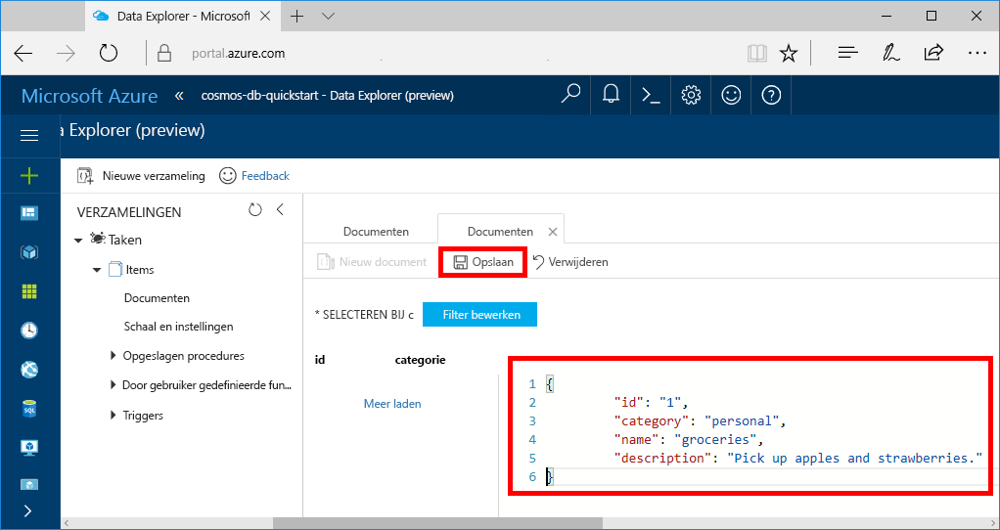

U kunt nu gegevens aan uw nieuwe verzameling toevoegen met behulp van Data Explorer.

1. De nieuwe database wordt in Data Explorer weergegeven in het deelvenster Verzamelingen. Vouw de database **Taken** uit, vouw de verzameling **Items** uit, klik op **Documenten** en klik vervolgens op **Nieuwe documenten**. 

   
  
2. Voeg nu een document toe aan de verzameling met de volgende structuur.

     ```json
     {
         "id": "1",
         "category": "personal",
         "name": "groceries",
         "description": "Pick up apples and strawberries.",
         "isComplete": false
     }
     ```

3. Zodra u de JSON hebt toegevoegd aan het tabblad **Documenten** klikt u op **Opslaan**.

    

4.  Maak nog één document en sla dit op. In het document voegt u een unieke waarde toe voor de eigenschap `id`. Wijzig de andere eigenschappen naar eigen inzicht. De nieuwe documenten kunnen elke gewenste structuur hebben, omdat in Azure Cosmos DB uw gegevens geen schema krijgen opgelegd.