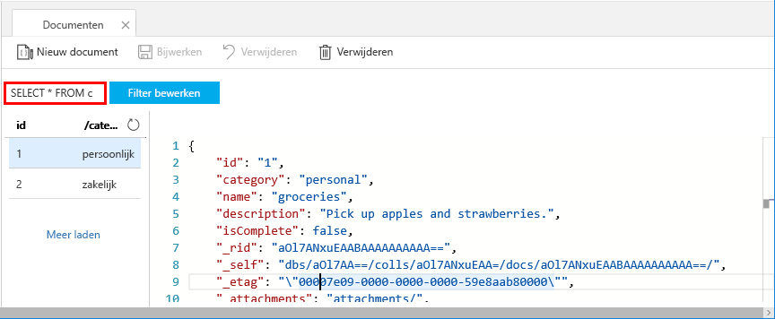
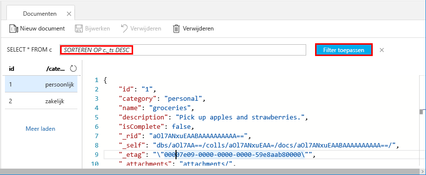

U kunt nu query's in Data Explorer gebruiken om uw gegevens te halen en te filteren.

1. U ziet dat de query standaard is ingesteld op `SELECT * FROM c`. Deze standaardquery haalt alle documenten in de verzameling op en geeft ze weer. 

    

2. Blijf op het tabblad **Documenten** en wijzig de query door op de knop **Filter bewerken** te klikken, `ORDER BY c._ts DESC` aan het vak Querypredicaat toe te voegen en vervolgens op **Filter toepassen** te klikken.

    

Deze gewijzigde query sorteert documenten in aflopende volgorde op basis van hun tijdstempel. Uw tweede document wordt nu dus als eerste weergegeven. Als u bekend bent met SQL-syntaxis, kunt u een van de ondersteunde [SQL-query's](../articles/cosmos-db/sql-api-sql-query.md) in dit vak invoeren. 

Ons werk in Data Explorer is voltooid. Voordat we verdergaan met het werken met code, willen we u erop wijzen dat u Data Explorer ook kunt gebruiken voor het maken van opgeslagen procedures, UDF's en triggers om bedrijfslogica aan de serverzijde uit te voeren en doorvoer te schalen. In Data Explorer wordt alle ingebouwde programmatische gegevenstoegang zichtbaar die beschikbaar is in de API's, maar biedt eenvoudige toegang tot uw gegevens in Azure Portal.