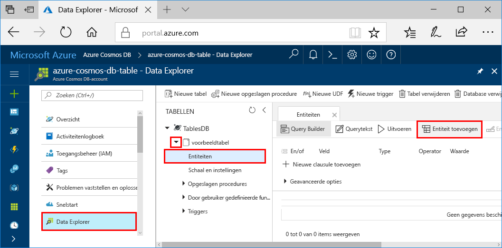
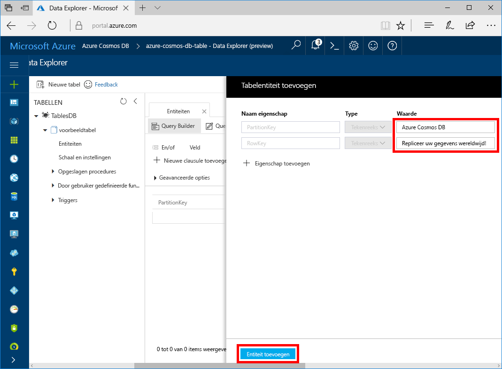

U kunt nu gegevens aan uw nieuwe tabel toevoegen met behulp van Data Explorer.

1. Vouw in Data Explorer **sample-table** uit, klik op **Entiteiten** en klik vervolgens op **Entiteit toevoegen**.

   
2. Voeg nu gegevens toe aan de vakken met een waarde voor PartitionKey en RowKey en klik op **Entiteit toevoegen**.

   
  
    U kunt nu meer entiteiten toevoegen aan uw tabel, uw entiteiten bewerken of een query op uw gegevens uitvoeren in Data Explorer. Data Explorer is ook de plek waar u uw doorvoer kunt schalen en opgeslagen procedures, door de gebruiker gedefinieerde functies en triggers aan uw tabel kunt toevoegen.