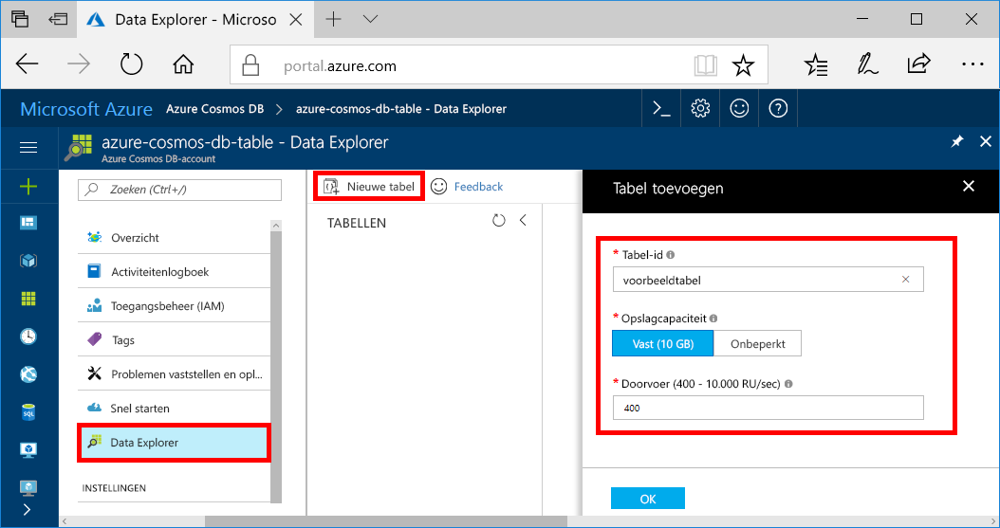
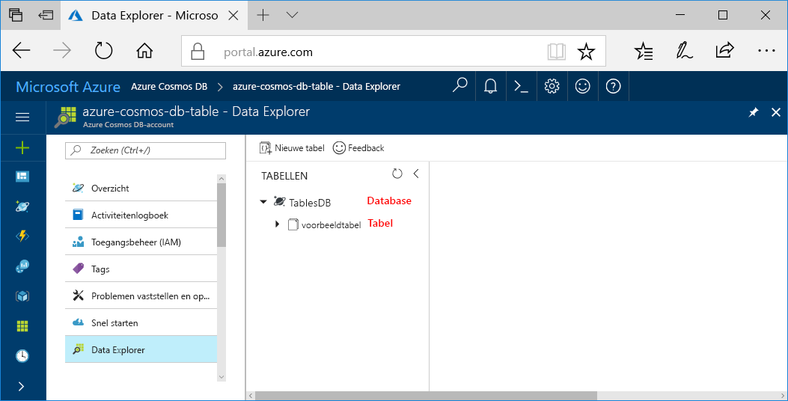

U kunt nu het hulpprogramma Data Explorer in Azure Portal gebruiken om een database en een tabel te maken. 

1. Klik op **Data Explorer** > **Nieuwe tabel**. 
    
    Helemaal rechts wordt het gebied **Tabel toevoegen** weergegeven. Mogelijk moet u naar rechts scrollen om het te zien.

    

2. Geef op de pagina **Tabel toevoegen** de instellingen voor de nieuwe tabel op.

    Instelling|Voorgestelde waarde|Beschrijving
    ---|---|---
    Tabel-id|voorbeeldtabel|De id voor de nieuwe tabel. Voor tabelnamen gelden dezelfde tekenvereisten als voor database-id's. Databasenamen moeten tussen de 1 en 255 tekens zijn en mogen geen `/ \ # ?` bevatten of eindigen op een spatie.
    Opslagcapaciteit| Vast (10 GB)|Wijzig de waarde in **Vast (10 GB)**. Deze waarde is de opslagcapaciteit van de database.
    Doorvoer|400 RU‘s|Wijzig de doorvoer in 400 aanvraageenheden per seconde (RU/s). U kunt de doorvoer later opschalen als u de latentie wilt beperken.

    Klik op **OK**.

    In Data Explorer worden de nieuwe database en tabel weergegeven.

    