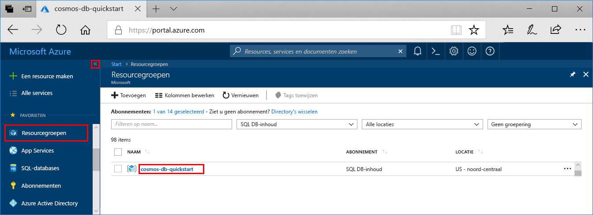

Als u deze app niet verder gaat gebruiken, kunt u alle resources verwijderen die door deze Quick Start zijn aangemaakt door de onderstaande stappen te volgen, zodat u geen kosten in rekening worden gebracht:

1. Selecteer in Azure Portal **Resourcegroepen** aan de linkerkant en selecteer vervolgens de resourcegroep die u hebt gemaakt.  

    Als het menu links is samengevouwen, klikt u op  om het menu uit te vouwen.

   

2. Selecteer de resourcegroep in het nieuwe venster en klik op **Resourcegroep verwijderen**.

      

3. Voer in het nieuwe venster de naam in van de resourcegroep die u wilt verwijderen en klik vervolgens op **Verwijderen**.

