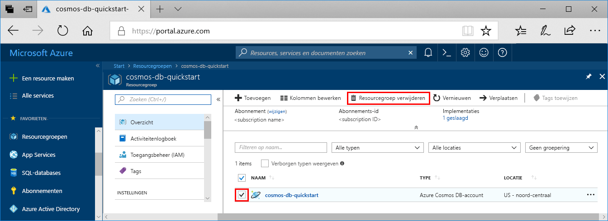

Als u niet gaat u deze app blijven gebruiken, verwijdert u alle resources die zijn gemaakt door deze snelstartgids met de volgende stappen, zodat u eventuele kosten niet:

1. Selecteer in de Azure-portal **resourcegroepen** aan de linkerkant.  

   

2. Selecteer in de lijst met resourcegroepen, de resourcegroep hebt gemaakt klik vervolgens op **resourcegroep verwijderen**.

3. Typ de naam van de resourcegroep verwijderen en klik vervolgens op **verwijderen**.

