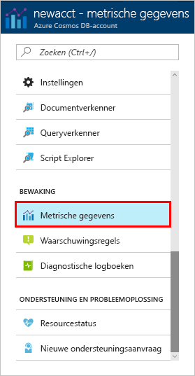
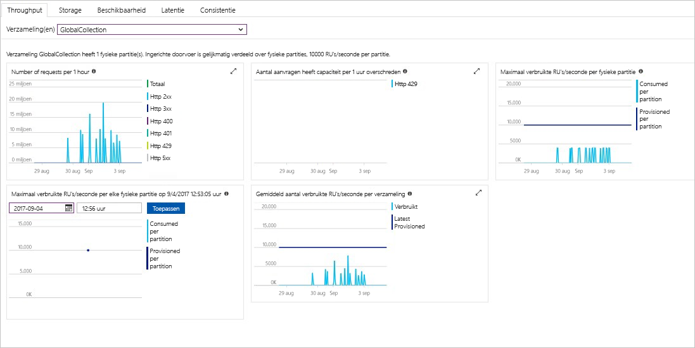

De doorvoer, opslag, beschikbaarheid, latentie en consistentie van de resources in uw account worden bewaakt in de Azure portal. U gaat nu een kort overzicht van deze metrische gegevens. 

1. Klik op **metrische gegevens** in het navigatiemenu.

   

2. Klik in de tabbladen zodat u op de hoogte van de metrische gegevens Azure Cosmos DB biedt. 

    Elke grafiek die gekoppeld aan de [Azure Cosmos DB Service Level Agreements (Sla's)](https://azure.microsoft.com/support/legal/sla/cosmos-db/) biedt een regel die laat zien als een van de serviceovereenkomsten zijn overtreden. Azure Cosmos DB maakt bewaking van uw serviceovereenkomsten die transparant met dit pakket van metrische gegevens. 

   