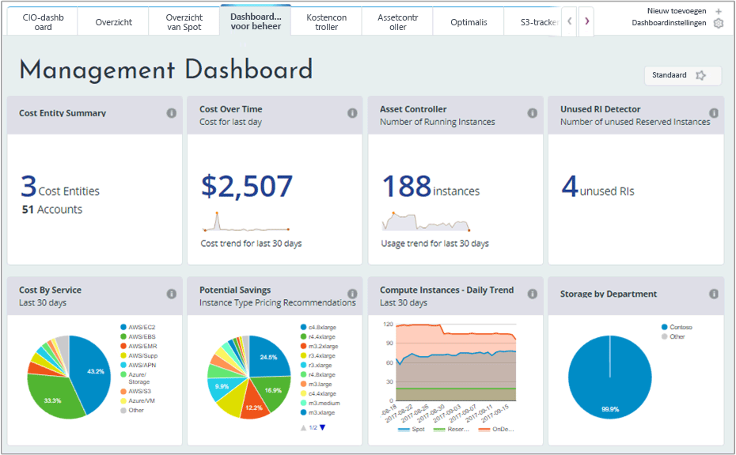
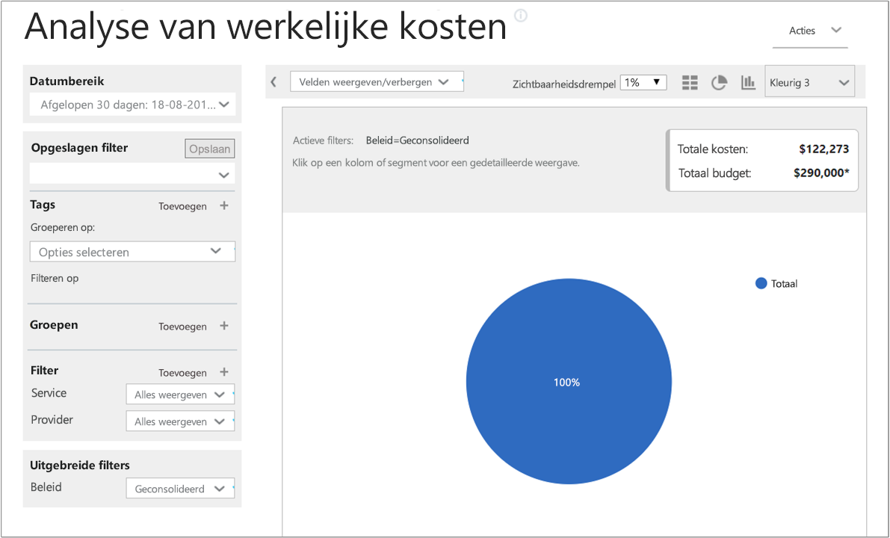
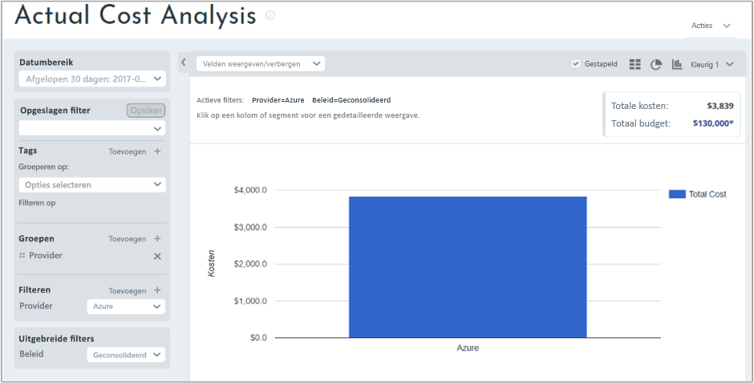
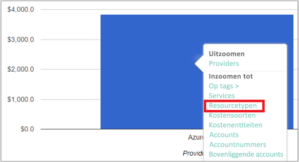
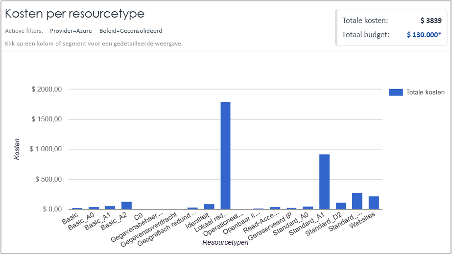
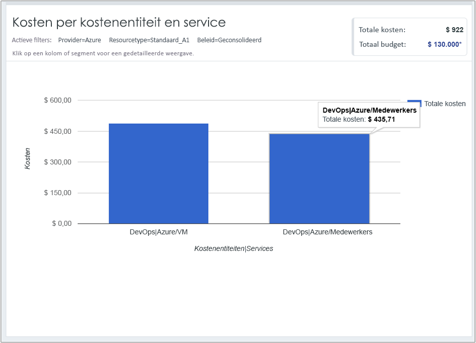

## Kostengegevens weergeven

Kostenbeheer van Azure door Cloudyn biedt u toegang tot al uw cloudresourcegegevens. Via de dashboardrapporten kunt u de standaard- en aangepaste rapporten vinden in een tabbladweergave. Hier volgen enkele voorbeelden van een populair dashboard en een rapport waarin u onmiddellijk de kostengegevens kunt zien.

In dit voorbeeld toont het Management Dashboard de geconsolideerde kosten voor het bedrijf Contoso van al hun cloudresources. Contoso maakt gebruik van Azure, AWS en Google. Dashboards bieden overzichtelijke informatie en een snelle manier om te navigeren door rapporten.  

Als u niet zeker weet wat het doel is van een rapport in een dashboard, beweegt u de muisaanwijzer over het symbool **i** om een uitleg te zien. Klik op een rapport in een dashboard om het volledige rapport weer te geven.

U kunt ook rapporten weergeven via het rapportenmenu boven aan de portal. Laten we eens de uitgaven van Concorde aan Azure-resources in de afgelopen 30 dagen bekijken. Klik op **Cost** > **Cost Analysis** > **Actual Cost Analysis**. Wis alle waarden als er waarden zijn ingesteld voor labels, groepen of filters in het rapport.

In dit voorbeeld zijn de totale kosten $ 75.970 en is het budget $ 130.000.

Nu gaan we de rapportindeling wijzigen en groepen en filters instellen om de resultaten voor Azure-kosten te verfijnen. Stel **Date Range** in op de afgelopen 30 dagen. Klik op het kolomsymbool in de rechterbovenhoek om het rapport op te maken als een staafdiagram en selecteer **Provider** onder Groups. Stel het filter voor **Provider** vervolgens in op **Azure**.

In dit voorbeeld bedragen de totale kosten van Azure-resources in de afgelopen 30 dagen $ 3.839.

Klik met de rechtermuisknop op de balk Provider (Azure) en zoom in op **Resource types**.

In de volgende afbeelding ziet u de kosten die Contoso heeft gemaakt voor Azure-resources. Het totaalbedrag is $ 3.839. In dit voorbeeld is ongeveer de helft van de kosten voor lokaal redundante opslag en de andere helft voor verschillende VM-exemplaren.

Klik met de rechtermuisknop op een resourcetype en selecteer **Cost Entities** om de kostenentiteiten en de services weer te geven die de resource hebt gebruikt. In dit voorbeeld hebben de VM- en Workers-services in de DevOps $ 486,60 en $ 435,71 verbruikt. Dit is in totaal $ 922.

Zie [Analyzing your cloud billing data with Azure Cost Management by Cloudyn](https://youtu.be/G0pvI3iLH-Y) (Uw factureringsgegevens voor de cloud analyseren met Azure Cost Management door Cloudyn) als u een video voor zelfstudie wilt bekijken over uw factureringsgegevens voor de cloud.
