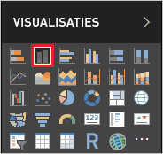
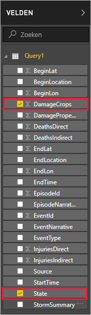
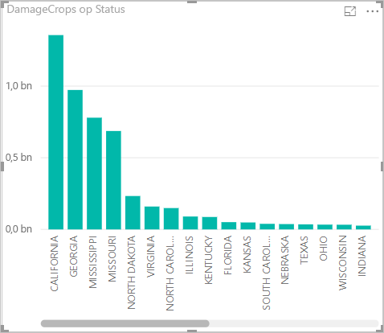

Nu u gegevens in Power BI Desktop hebt, kunt u rapporten maken op basis van die gegevens. U maakt een eenvoudig rapport met een kolomdiagram dat de schade aan het gewas per staat laat zien.

1. Selecteer de rapportweergave aan de linkerkant van het hoofdvenster van Power BI.

    

1. Selecteer in het deelvenster **VISUALISATIES** het gegroepeerde kolomdiagram.

    

    Er wordt een leeg diagram aan het tekenvel toegevoegd.

    

1. Selecteer in de lijst **VELDEN** **DamageCrops** en **State**.

    

    U hebt nu een grafiek waarin de schade aan gewassen voor de top-1000 rijen worden weergegeven in de tabel.

    

1. Sla het rapport op.