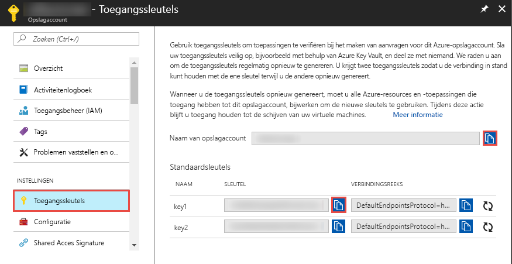
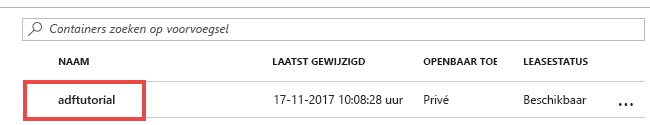

## <a name="prerequisites"></a>Vereisten

### <a name="azure-subscription"></a>Azure-abonnement
Als u nog geen abonnement op Azure hebt, maak dan een [gratis account](https://azure.microsoft.com/free/) aan voordat u begint.

### <a name="azure-roles"></a>Azure-rollen
Als u Data Factory-exemplaren wilt maken, moet het gebruikersaccount waarmee u zich bij Azure aanmeldt, lid zijn van de rol *Inzender* of *Eigenaar*, of moet dit een *beheerder* van het Azure-abonnement zijn. Als u de machtigingen die u in het abonnement hebt, wilt bekijken, gaat u naar Azure Portal, selecteert u rechtsboven uw gebruikersnaam en selecteert u vervolgens **Machtigingen**. Als u toegang tot meerdere abonnementen hebt, moet u het juiste abonnement selecteren. 

Als u onderliggende resources wilt maken en beheren voor Data Factory, waaronder gegevenssets, gekoppelde services, pijplijnen, triggers en integratieruntimes, zijn de volgende vereisten van toepassing:
- Als u onderliggende resources in Azure Portal wilt maken en beheren, moet u de rol **Data Factory-inzender** op minimaal het niveau van de resourcegroep hebben.
- Voor het maken en beheren van onderliggende resources met PowerShell of de SDK is de rol **Inzender** op minimaal het resourceniveau voldoende.

Zie het artikel [Rollen toevoegen](../articles/billing/billing-add-change-azure-subscription-administrator.md) voor voorbeelden van instructies voor het toevoegen van een gebruiker aan een rol.

Raadpleeg voor meer informatie de volgende artikelen:
- [Rol Data Factory-inzender](../articles/role-based-access-control/built-in-roles.md#data-factory-contributor)
- [Rollen en machtigingen voor Azure Data Factory](../articles/data-factory/concepts-roles-permissions.md)

### <a name="azure-storage-account"></a>Azure Storage-account
In deze Snelstart gaat u een algemeen Azure Storage-account (en dan met name voor Blob Storage) gebruiken als zowel *bron-* als *doel*gegevensarchieven. Zie het artikel [Een opslagaccount maken](../articles/storage/common/storage-quickstart-create-account.md) als u geen Azure Storage-account hebt voor algemene doeleinden en er een wilt maken. 

#### <a name="get-the-storage-account-name-and-account-key"></a>De naam en sleutel van een opslagaccount ophalen
In deze snelstart gaat u de naam en sleutel van uw Azure Storage-account gebruiken. De volgende procedure bevat stappen waarmee u de naam en sleutel van uw opslagaccount kunt ophalen: 

1. Ga in een webbrowser naar [Azure Portal](https://portal.azure.com). Meld u aan met de gebruikersnaam en het wachtwoord van Azure. 
2. Selecteer **Alle services** in het menu links, filter op het trefwoord **Opslag** en selecteer **Opslagaccounts**.

   
3. Filter in de lijst met opslagaccounts op uw opslagaccount (indien nodig) en selecteer vervolgens uw opslagaccount. 
4. Selecteer op de pagina **Opslagaccount** de optie **Toegangssleutels** in het menu.

   
5. Kopieer de waarden voor de vakken **Opslagaccountnaam** en **key1** naar het klembord. Plak deze in Kladblok of een andere editor en sla ze op. U gebruikt ze verderop in deze QuickStart.   

#### <a name="create-the-input-folder-and-files"></a>Invoermap en bestanden maken
In deze sectie maakt u in Azure Blob Storage een blobcontainer met de naam **adftutorial**. U maakt in de container een map met de naam **Invoer** en u uploadt een voorbeeldbestand naar de map Invoer. 

1. Schakel op de pagina **Opslagaccount** over naar **Overzicht** en selecteer **Blobs**. 

   
2. Selecteer op de pagina **Blob service** in de werkbalk de optie **+ Container**. 

       
3. Voer in het dialoogvenster **Nieuwe container** als naam **adftutorial** in en selecteer **OK**. 

   
4. Selecteer **adftutorial** in de lijst met containers. 

   
5. Selecteer op de pagina **Container** in de werkbalk de optie **Uploaden**.  

   
6. Selecteer op de pagina **Blob uploaden** de optie **Geavanceerd**.

   
7. Start **Kladblok** en maak een bestand met de naam **emp.txt** met de volgende inhoud. Sla deze op in de map **c:\ADFv2QuickStartPSH**. Maak de map **ADFv2QuickStartPSH** als deze nog niet bestaat.
    
   ```
   John, Doe
   Jane, Doe
   ```    
8. Blader in Azure Portal op de pagina **Blob uploaden** naar het bestand **emp.txt** en selecteer dit voor het vak **Bestanden**. 
9. Typ **Invoer** als waarde voor het vak **Uploaden naar map**. 

        
10. Controleer of de map **Invoer** en het bestand **emp.txt** is en selecteer **Uploaden**.
    
    Als het goed is, ziet u in de lijst nu het bestand **emp.txt**, evenals de uploadstatus hiervan. 
12. Sluit de pagina **Blob uploaden** door op de **X** in de hoek te klikken. 

    
1. Houd de pagina **Container** geopend. U gaat hiermee aan het einde van deze QuickStart de uitvoer controleren.