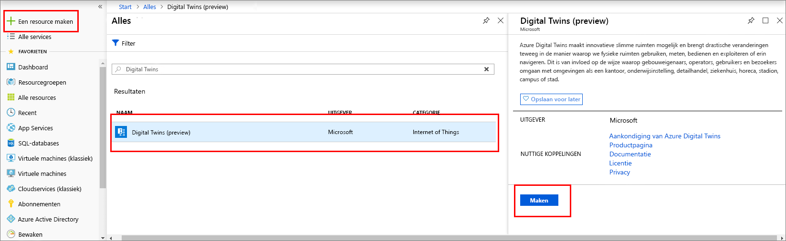
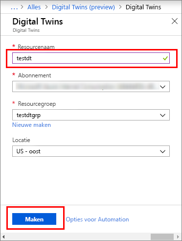

1. Meld u aan bij [Azure Portal](http://portal.azure.com).

1. Selecteer **Een resource maken** in het linkerdeelvenster. Zoek op **digital twins** en selecteer **Digital Twins (preview)**. Selecteer **Maken** om het implementatieproces te starten.

   

1. In het deelvenster **Digital Twins** voert u de volgende informatie in:
   * **Resourcenaam**: geef uw instantie van Digital Twins een unieke naam.
   * **Abonnement**: kies het abonnement dat u wilt gebruiken om deze instantie van Digital Twins te maken. 
   * **Resourcegroep**: selecteer of maak een [resourcegroep](https://docs.microsoft.com/azure/azure-resource-manager/resource-group-overview#resource-groups) voor de instantie van Digital Twins.
   * **Locatie**: Selecteer de dichtstbijzijnde locatie voor uw apparaten.

     

1. Controleer uw Digital Twins-gegevens en selecteer **Maken**. Het kan een paar minuten duren voordat uw instantie van Digital Twins is gemaakt. U kunt de voortgang bewaken via het deelvenster **Meldingen**.

1. Open het deelvenster **Overzicht** van de instantie van Digital Twins. Zoals u ziet, wordt er een koppeling weergegeven onder **Beheer API**.

   De indeling van de URL van de **Beheer API** is `https://yourDigitalTwinsName.yourLocation.azuresmartspaces.net/management/swagger`. Deze URL leidt u naar de documentatie van de REST API van Azure Digital Twins, die van toepassing is op uw instantie. Zie [Het gebruik van Azure Digital Twins Swagger](../articles/digital-twins/how-to-use-swagger.md) voor informatie over hoe u deze API-documentatie dient te lezen en gebruiken.

    Wijzig de URL van de **Beheer API** als volgt: `https://yourDigitalTwinsName.yourLocation.azuresmartspaces.net/management/api/v1.0/`. Uw toepassing gebruikt de aangepaste URL als de basis-URL voor toegang tot uw instantie. Kopieer deze gewijzigde URL naar een tijdelijk bestand. U hebt deze URL nodig in de volgende sectie.

    