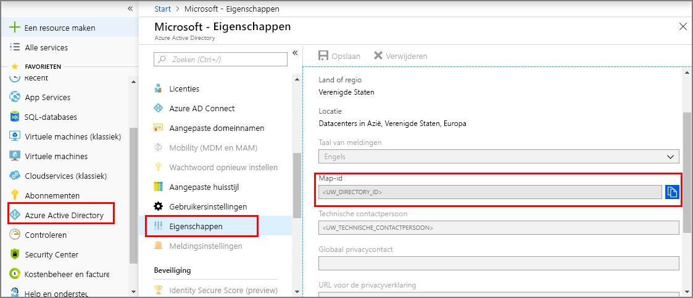
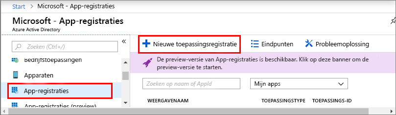
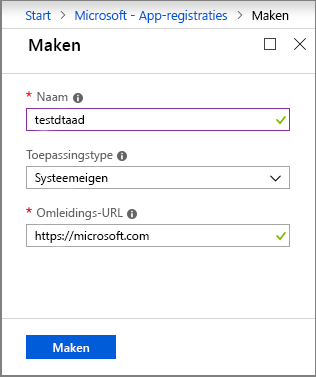
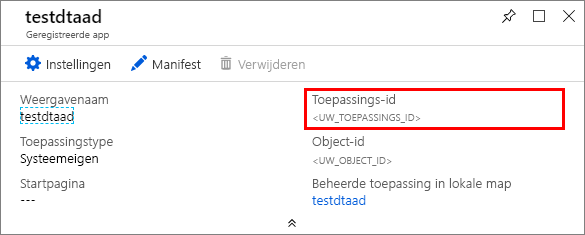

1. Open in de [Azure-portal](https://portal.azure.com) **Azure Active Directory** in het navigatievenster aan de linkerkant en open vervolgens het deelvenster **Eigenschappen**. Kopieer de **Map-id** naar een tijdelijk bestand. U gebruikt deze waarde om de voorbeeldtoepassing in de volgende sectie te configureren.

    

1. Open het deelvenster **App-registraties** en klik vervolgens op de knop **Nieuwe toepassing registreren**.
    
    

1. Geef een beschrijvende naam voor deze app-registratie op in het veld **Naam**. Kies voor **Toepassingstype** de optie **_Systeemeigen_** en voor **Omleidings-URI** **_https://microsoft.com_**. Klik op **Create**.

    

1. Open de geregistreerde app en kopieer de waarde van het veld **Toepassings-id** naar een tijdelijk bestand; deze waarde identificeert uw Azure Active Directory-app. U gebruikt de toepassings-id om uw voorbeeldtoepassing in de volgende secties te configureren.

    

1. Open het deelvenster App-registratie, en klik op **Instellingen** > **Vereiste machtigingen**:
    - Klik linksboven op **Toevoegen** om het deelvenster **API-toegang toevoegen** te openen.
    - Klik op **Een API selecteren** en zoek naar **Azure Digital Twins**. Als de API met uw zoekopdracht niet wordt gevonden, zoekt u in plaats daarvan **Azure Smart Spaces**.
    - Selecteer de optie **Azure Digital Twins (Azure Smart Spaces-service)** en klik op **Selecteren**.
    - Klik op **Machtigingen selecteren**. Controleer het vak **Lees-/schrijftoegang** voor gedelegeerde machtigingen en klik op **Selecteren**.
    - Klik op **Gereed** in het deelvenster **API-toegang toevoegen**.
    - Klik in het deelvenster **Vereiste machtigingen**op de knop **Machtigingen verlenen** en accepteer de bevestiging die wordt weergegeven.

       
