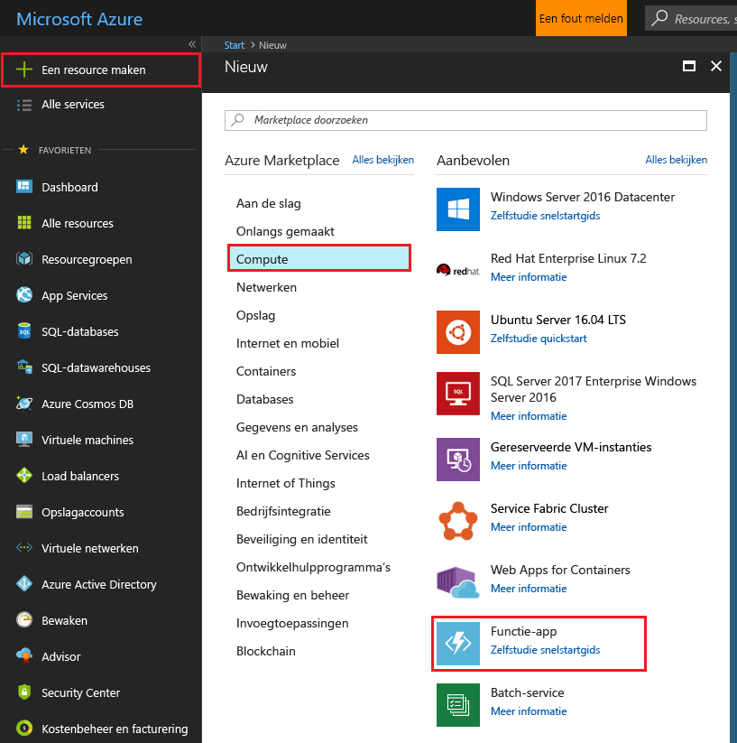
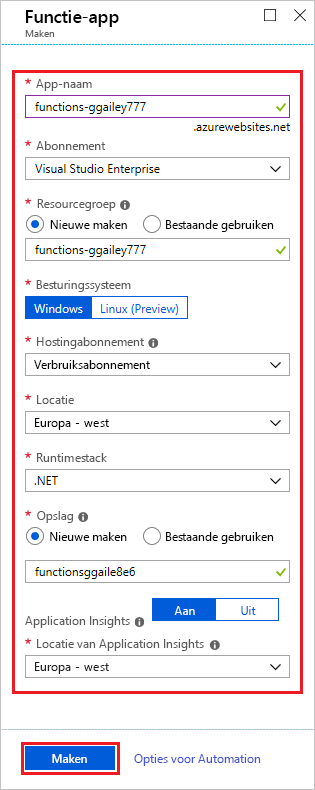
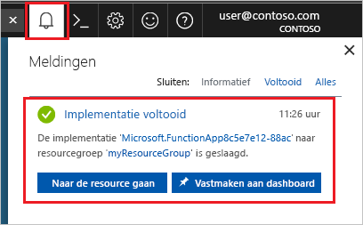

1. Klik op de **nieuw** knop gevonden in de linkerbovenhoek van de Azure portal, vervolgens selecteert **Compute** > **functie-App**. 

    

2. Gebruik de functie app-instellingen zoals opgegeven in de tabel hieronder de installatiekopie.

    

    | Instelling      | Voorgestelde waarde  | Beschrijving                                        |
    | ------------ |  ------- | -------------------------------------------------- |
    | **Naam van app** | Wereldwijd unieke naam | Naam waarmee uw nieuwe functie-app wordt aangeduid. Geldige tekens zijn `a-z`, `0-9`, en `-`.  | 
    | **Abonnement** | Uw abonnement | Het abonnement waaronder deze nieuwe functie-app wordt gemaakt. | 
    | **[Resourcegroep](../articles/azure-resource-manager/resource-group-overview.md)** |  myResourceGroup | Naam voor de nieuwe resourcegroep waarin uw functie-app moet worden gemaakt. | 
    | **OS** | Windows | Zonder server die als host fungeert is momenteel alleen beschikbaar wanneer u gebruikmaakt van Windows. Zie voor het hosten van Linux [maken van uw eerste functie met op Linux met de Azure CLI](../articles/azure-functions/functions-create-first-azure-function-azure-cli-linux.md). |
    | **[Hostingplan](../articles/azure-functions/functions-scale.md)** |   Verbruiksabonnement | Hostingabonnement dat definieert hoe resources worden toegewezen aan uw functie-app. In het standaard **Verbruiksabonnement** worden resources dynamisch toegevoegd zoals door uw functies wordt vereist. In deze [zonder server](https://azure.microsoft.com/overview/serverless-computing/) host, u betaalt alleen voor de uitvoering van uw functies.   |
    | **Locatie** | West-Europa | Kies een [regio](https://azure.microsoft.com/regions/) in de buurt of in de buurt van andere services uw functies toegang hebben tot. |
    | **[Opslagaccount](../articles/storage/common/storage-create-storage-account.md#create-a-storage-account)** |  Wereldwijd unieke naam |  Naam van het nieuwe opslagaccount dat door uw functie-app wordt gebruikt. Namen van opslagaccounts moeten tussen 3 en 24 tekens lang zijn en mogen alleen cijfers en kleine letters bevatten. U kunt ook een bestaand account gebruiken. |

1. Klik op **Maken** om de nieuwe functie-app in te richten en te implementeren. U kunt de status van de implementatie controleren door te klikken op het pictogram melding in de rechterbovenhoek van de portal. 

    

    Te klikken op **gaat u naar de resource** gaat u naar uw nieuwe functie-app.
