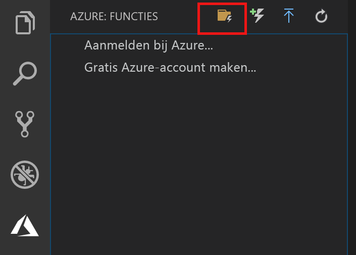
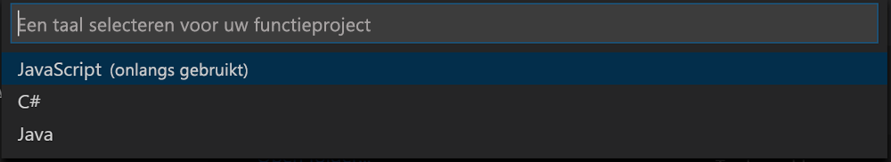

## Een Azure Functions-project maken

De Azure Functions-projectsjabloon in Visual Studio Code maakt een project dat kan worden gepubliceerd in een functie-app in Azure. Met een functie-app kunt u functies groeperen in een logische eenheid, zodat u resources kunt beheren, implementeren en delen.

1. Selecteer in Visual Studio Code het Azure-logo om het gebied **Azure: Functions** weer te geven. Selecteer vervolgens het pictogram Create New Project (Nieuw project maken).

    

1. Kies een locatie voor de werkruimte van uw project en kies **Select** (Selecteren).

    > [!NOTE]
    > Dit artikel is bedoeld om buiten een werkruimte te worden voltooid. Selecteer in dit geval geen projectmap die deel uitmaakt van een werkruimte.

1. Selecteer de taal voor uw functie-appproject. In dit artikel wordt JavaScript gebruikt.
    

1. Kies **Add to workspace** (Aan werkruimte toevoegen) als daarom wordt gevraagd.

Het functie-appproject wordt in een nieuwe werkruimte gemaakt. Het project bevat de configuratiebestanden [host.json](../articles/azure-functions/functions-host-json.md) en [local.settings.json](../articles/azure-functions/functions-run-local.md#local-settings-file), plus eventuele taalspecifieke projectbestanden. In de projectmap ziet u ook een nieuwe Git-opslagplaats.