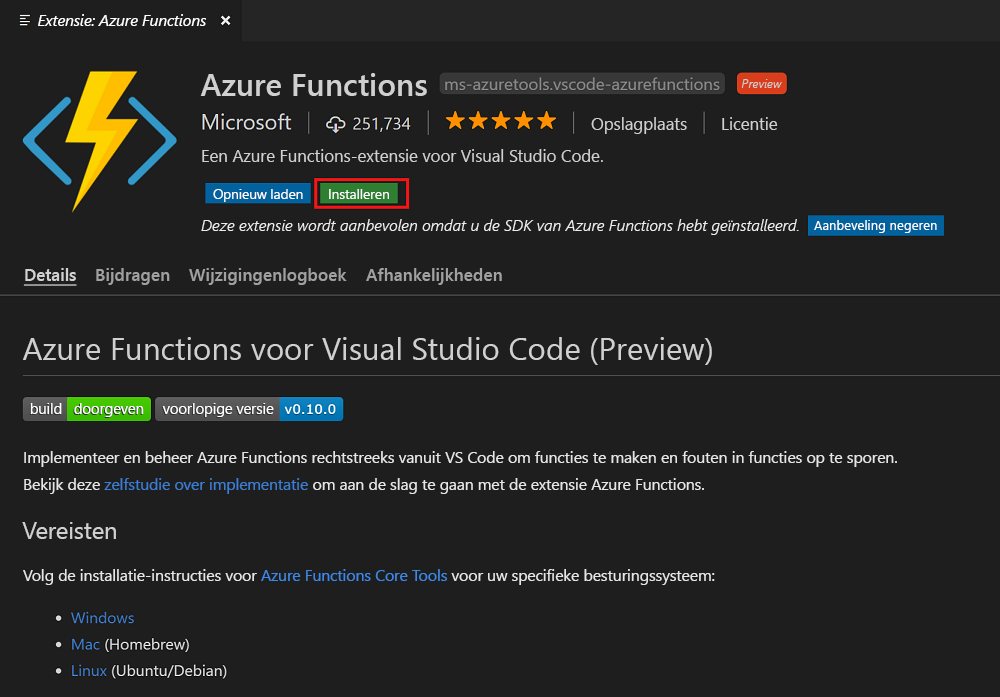
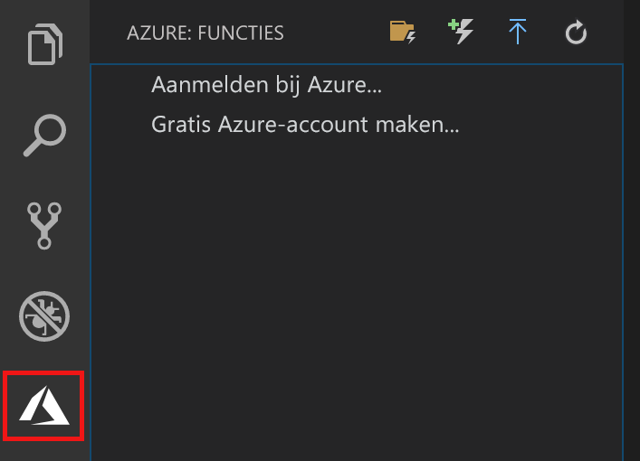

## De Azure Function-extensie installeren

De Azure Functions-extensie wordt gebruikt om functies in Azure te maken, testen en implementeren.

1. Open in Visual Studio Code de optie **Extensions** (Extensies) en zoek `azure functions` of [open deze koppeling in Visual Studio Code](vscode:extension/ms-azuretools.vscode-azurefunctions).

1. Selecteer **Install** (Installeren) om de extensie in Visual Studio Code te installeren.

    

1. Start Visual Studio Code opnieuw en selecteer het Azure-pictogram in de balk Activiteit. Het gebied Azure Functions moet nu in de zijbalk worden weergegeven.

    