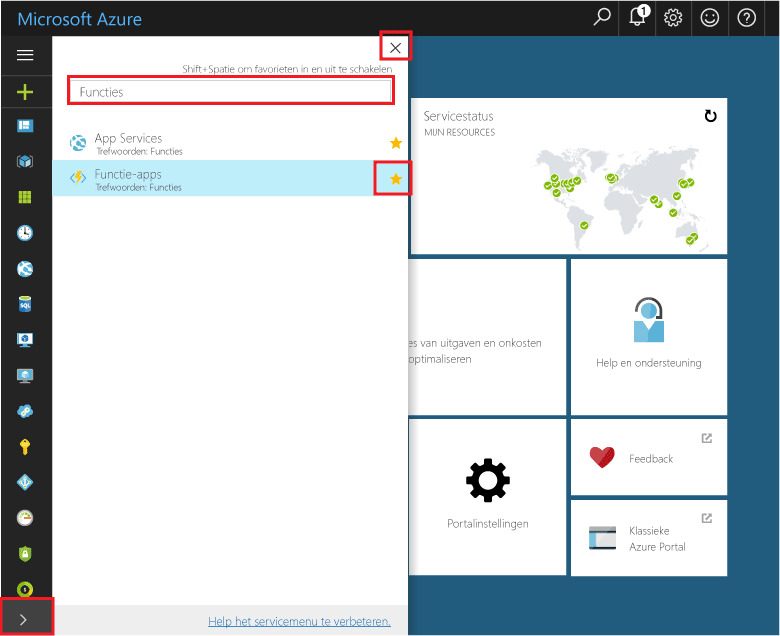

## Favoriete functies in de portal 

Als u dit nog niet hebt gedaan, kunt u functie-apps toevoegen aan uw favorieten in Azure Portal. Zo kunt u uw functie-apps gemakkelijker vinden. Als u dit al hebt gedaan, gaat u naar de volgende sectie. 

1. Meld u aan bij [Azure Portal](https://portal.azure.com/).

2. Klik op de pijl linksonder om alle services uit te vouwen, typ `Functions` in het veld **Filter** en klik vervolgens op de ster naast **Functie-apps**.  
 
    

    Hiermee wordt het pictogram Functies toegevoegd aan het menu aan de linkerkant van de portal.

3. Sluit het menu en scrol omlaag naar het pictogram Functies. Klik op dit pictogram om een lijst met al uw functie-apps weer te geven. Klik op uw functie-app om met functies in deze app te werken. 
 
    
 
     