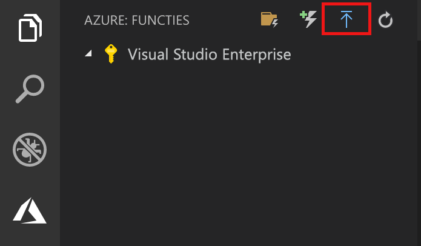
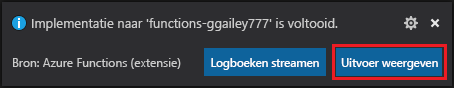
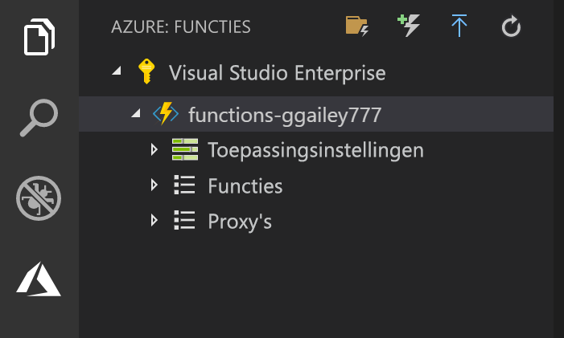

## Het project naar Azure publiceren

In Visual Studio Code kunt u uw functieproject rechtstreeks in Azure publiceren. In dit proces maakt u een functie-app en de bijbehorende resources in uw Azure-abonnement. De functie-app biedt een context waar u uw functies kunt uitvoeren. Het project wordt in uw Azure-abonnement verpakt en geïmplementeerd in de nieuwe functie-app. 

In dit artikel wordt ervan uitgegaan dat u een nieuwe functie-app maakt. Als u in een bestaande functie-app publiceert, wordt de inhoud van die app in Azure overschreven.

1. Ga naar het gebied **Azure: Functions** en selecteer het pictogram Deploy to Function App (Implementeren naar functie-app).

    

1. Kies de projectmap. Dit is uw huidige werkruimte.

1. Als u meerdere abonnementen hebt, kies dan het abonnement dat u voor het hosten van uw functie-app wilt gebruiken, kies vervolgens **+ Create New Function App** (+ Nieuwe functie-app maken).

1. Typ een unieke naam waarmee de functie-app wordt geïdentificeerd en druk op Enter. Geldige tekens voor de naam van en functie-app zijn `a-z`, `0-9` en `-`.

1. Kies **+ Create New Resource Group** (+ Nieuwe resourcegroep maken), typ de naam van een resourcegroep, bijvoorbeeld `myResourceGroup`, en druk op Enter. U kunt ook een bestaande resourcegroep gebruiken.

1. Kies **+Create New Storage Account**, typ een unieke naam voor het nieuwe opslagaccount dat door de functie-app wordt gebruikt en druk op Enter. Namen van opslagaccounts moeten tussen 3 en 24 tekens lang zijn en mogen alleen cijfers en kleine letters bevatten. U kunt ook een bestaand account gebruiken.

1. Kies een locatie in een [regio](https://azure.microsoft.com/regions/) bij u in de buurt of in de buurt van andere services die door uw functies worden gebruikt.

    De functie-app wordt gemaakt nadat u de locatie hebt gekozen. Nadat de functie-app is gemaakt en het implementatiepakket is toegepast, wordt er een melding weergegeven.

1. Selecteer in de meldingen de optie **View Output** (Uitvoer weergeven) om de resultaten van het maken en implementeren te bekijken, inclusief de Azure-resources die u hebt gemaakt.

    

1. Noteer de URL van de nieuwe functie-app in Azure. U gebruikt deze om de functie te testen nadat het project in Azure is gepubliceerd.

    

1. Weer terug in het gebied **Azure: Functions** ziet u de nieuwe functie weergegeven onder uw abonnement. Als u dit knooppunt uitvouwt, ziet u de functies in de functie-app, evenals de instellingen voor de toepassing en de functieproxy's.

    

    Vanuit het knooppunt van de functie-app typt u Ctrl en klikt u met de rechtermuisknop zodat u verschillende beheer- en configuratietaken kunt uitvoeren voor de functie-app in Azure. U kunt de functie-app ook bekijken in de Azure-portal.
