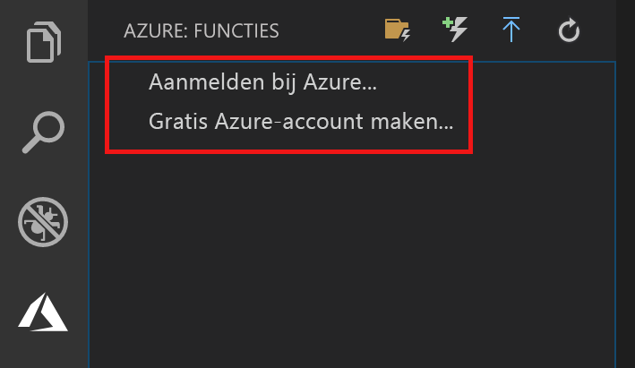

## Aanmelden bij Azure

Voordat u de app kunt publiceren, moet u zich aanmelden bij Azure.

1. Ga naar het gebied **Azure: Functions** en kies **Sign in to Azure...** (Aanmelden bij Azure...). Hier kunt u **een gratis Azure-account** aanmaken als u dat nog niet hebt.

    

1. Selecteer **Copy & Open** (Kopiëren en openen) of kopieer de weergegeven code en open <https://aka.ms/devicelogin> in de browser.

1. Plak de gekopieerde code op de pagina **Device Login** (Apparaataanmelding), controleer de aanmelding voor Visual Studio Code en selecteer **Doorgaan**.  

1. Voltooi het aanmelden met de referenties voor uw Azure-account. Nadat u bent aangemeld, kunt u de browser sluiten.
