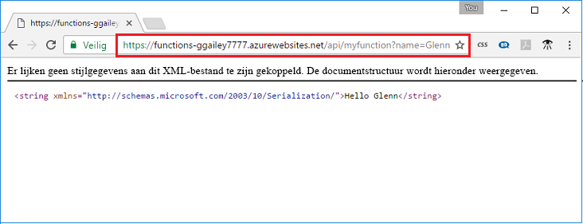

## <a name="test"></a>De functie testen

Gebruik cURL om de geïmplementeerde functie te testen op een Mac- of Linux-computer of met Bash op Windows. Voer de volgende cURL-opdracht uit, waarbij u de plaatsaanduiding `<app_name>` vervangt door de naam van de functie-app die u hebt gemaakt. Voeg de queryreeks `&name=<yourname>` toe aan de URL.

```bash
curl http://<app_name>.azurewebsites.net/api/HttpTriggerJS1?name=<yourname>
```  

  

Als cURL niet beschikbaar is op uw opdrachtregel, moet u gewoon dezelfde URL opgeven op de adresbalk van uw webbrowser. Vervang weer de plaatsaanduiding `<app_name>` door de naam van uw functie-app, voeg de queryreeks `&name=<yourname>` toe aan de URL en voer de aanvraag uit. 

    http://<app_name>.azurewebsites.net/api/HttpTriggerJS1?name=<yourname>
   
  
