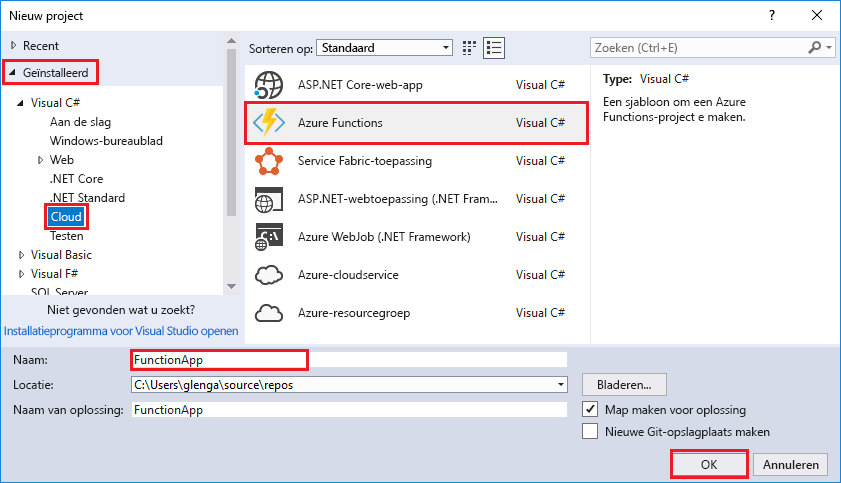
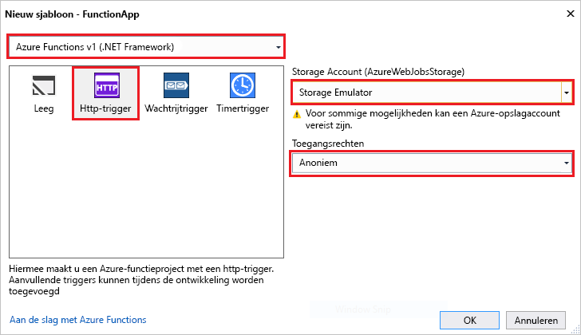

De Azure Functions-projectsjabloon in Visual Studio maakt een project dat kan worden gepubliceerd in een functie-app in Azure. Een functie-app kunt u functies groeperen als één logische eenheid voor beheer, implementatie en het delen van bronnen.   

1. Selecteer in Visual Studio **nieuw** > **Project** van de **bestand** menu. 

2. In de **nieuw Project** dialoogvenster Selecteer **geïnstalleerde**, vouw **Visual C#** > **Cloud**, selecteer **Azure Functies**, typ een **naam** voor uw project en klik op **OK**. De functie-appnaam moet geldig zijn als een C#-naamruimte. Gebruik dus geen onderstrepingstekens, afbreekstreepjes of andere niet-alfanumerieke tekens. 

     

2. Gebruik de instellingen die zijn opgegeven in de tabel die volgt op de installatiekopie.
 
     

    | Instelling      | Voorgestelde waarde  | Beschrijving                      |
    | ------------ |  ------- |----------------------------------------- |
    | **Versie** | Azure Functions v1  (.NET Framework) | Hiermee maakt u een functie-project dat gebruikmaakt van de runtime van versie 1 van Azure Functions. De runtime van versie 2, die ondersteuning biedt voor .NET Core, is momenteel in preview. Zie voor meer informatie [hoe doelversie Azure Functions-runtime](../articles/azure-functions/functions-versions.md).   | 
    | **Sjabloon** | HTTP-trigger | Hiermee maakt u een functie die wordt geactiveerd door een HTTP-aanvraag. |
    | **Opslagaccount**  | Opslagemulator | Een HTTP-trigger niet de Storage-account verbinding gebruikt. Alle andere triggertypen moeten een geldige verbindingsreeks van de Storage-account. |
    | **Toegangsrechten** | Anoniem | De gemaakte functie kan worden geactiveerd door een client zonder op te geven van een sleutel. Deze instelling autorisatie kunt eenvoudig uw nieuwe functie testen. Zie voor meer informatie over sleutels en autorisatie [autorisatie sleutels](../articles/azure-functions/functions-bindings-http-webhook.md#authorization-keys) in de [HTTP- en webhook bindingen](../articles/azure-functions/functions-bindings-http-webhook.md). |         
3. Klik op **OK** voor het maken van de functie-project en HTTP-functie geactiveerd. 

