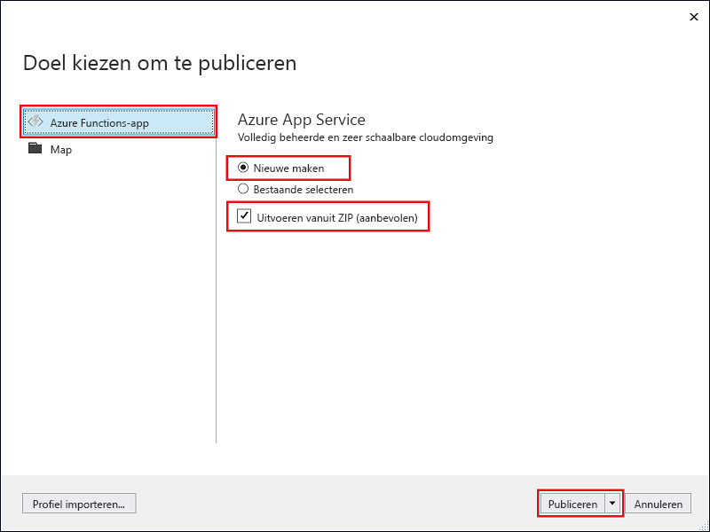

1. Klik in **Solution Explorer** met de rechtermuisknop op het project en selecteer **Publiceren**.

2. Selecteer **Azure-functie-app**, kies **Nieuwe maken** en selecteer vervolgens **Publiceren**.

    

2. Als u Visual Studio nog niet aan uw Azure-account hebt gekoppeld, selecteert u **Een account toevoegen...**.

3. In het dialoogvenster **App-service maken** gebruikt u de **hosting**instellingen zoals weergegeven in de tabel onder de afbeelding:

    

    | Instelling      | Voorgestelde waarde  | Beschrijving                                |
    | ------------ |  ------- | -------------------------------------------------- |
    | **Naam van app** | Wereldwijd unieke naam | Naam waarmee uw nieuwe functie-app uniek wordt aangeduid. |
    | **Abonnement** | Kies uw abonnement | Het te gebruiken Azure-abonnement. |
    | **[Resourcegroep](../articles/azure-resource-manager/resource-group-overview.md)** | myResourceGroup |  Naam van de resourcegroep waarin uw functie-app moet worden gemaakt. Kies **Nieuw** om een nieuwe resourcegroep te maken.|
    | **[App-serviceabonnement](../articles/azure-functions/functions-scale.md)** | Verbruiksabonnement | Zorg dat u het **Verbruik** kiest onder **Grootte** nadat u op **Nieuw** hebt geklikt om een abonnement te maken. Kies ook een **Locatie** in een [regio](https://azure.microsoft.com/regions/) bij u in de buurt of in de buurt van andere services die door uw functies worden gebruikt.  |
    | **[Opslagaccount](../articles/storage/common/storage-create-storage-account.md#create-a-storage-account)** | Algemeen opslagaccount | Er is een Azure-opslagaccount vereist voor de Functions-runtime. Klik op **Nieuw** om een algemeen opslagaccount te maken of gebruik een bestaand account.  |

4. Klik op **Maken** om een functie-app en verwante resources met deze instellingen te maken in Azure en implementeer de code voor uw functieproject. 

5. Noteer de **Site-URL** wanneer de implementatie is voltooid. Dit is het adres van uw functie-app in Azure.

    
