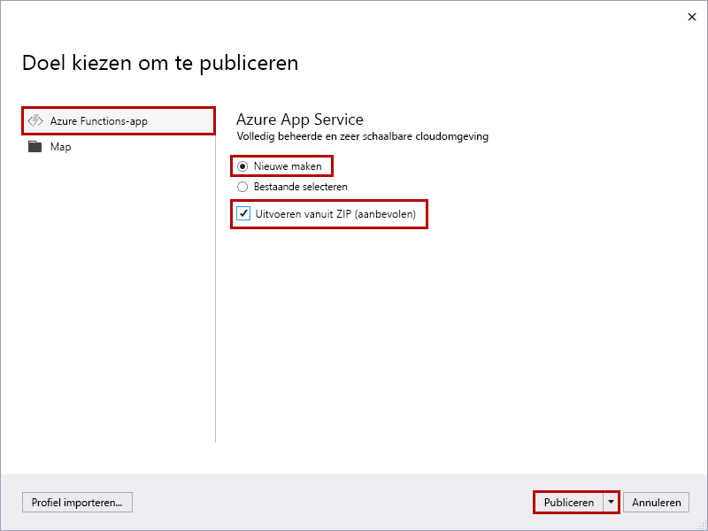
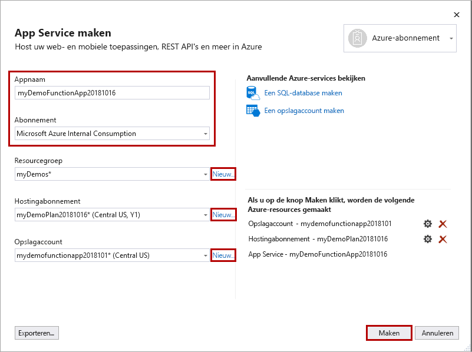

1. Klik in **Solution Explorer** met de rechtermuisknop op het project en selecteer **Publiceren**.

2. Selecteer **Azure-functie-app**, kies **Nieuwe maken** en selecteer vervolgens **Publiceren**.

     

    Wanneer u klikt op **uitvoeren vanuit een pakketbestand (aanbevolen)** , uw functie-app wordt geïmplementeerd met behulp van [Zip implementeren](../articles/azure-functions/functions-deployment-technologies.md#zip-deploy) met [uitvoeren-van-Package](../articles/azure-functions/run-functions-from-deployment-package.md) -modus is ingeschakeld. Dit is de aanbevolen manier van het uitvoeren van uw functies, en zal leiden tot betere prestaties.

    >[!CAUTION]
    >Als u **Bestaande selecteren** kiest, worden alle bestanden in de bestaande functie-app in Azure overschreven door bestanden uit het lokale project. Gebruik deze optie alleen als u updates opnieuw publiceert naar een bestaande functie-app.

3. Als u Visual Studio nog niet aan uw Azure-account hebt gekoppeld, selecteert u **Een account toevoegen...** .

4. In het dialoogvenster **App-service maken** gebruikt u de **hosting**instellingen zoals weergegeven in de tabel onder de afbeelding:

    

    | Instelling      | Voorgestelde waarde  | Description                                |
    | ------------ |  ------- | -------------------------------------------------- |
    | **Naam van app** | Wereldwijd unieke naam | Naam waarmee uw nieuwe functie-app uniek wordt aangeduid. |
    | **Abonnement** | Kies uw abonnement | Het te gebruiken Azure-abonnement. |
    | **[Resourcegroep](../articles/azure-resource-manager/resource-group-overview.md)** | myResourceGroup |  Naam van de resourcegroep waarin uw functie-app moet worden gemaakt. Kies **Nieuw** om een nieuwe resourcegroep te maken.|
    | **[App-serviceabonnement](../articles/azure-functions/functions-scale.md)** | Verbruiksabonnement | Zorg ervoor dat u **Verbruik** kiest onder **Grootte** nadat u op **Nieuw** hebt geklikt om een serverloos abonnement te maken. Kies ook een **Locatie** in een [regio](https://azure.microsoft.com/regions/) bij u in de buurt of in de buurt van andere services die door uw functies worden gebruikt. Wanneer u in een abonnement van een ander type dan **Verbruik** werkt, moet u de [schaal van uw functie-app](../articles/azure-functions/functions-scale.md) beheren.  |
    | **[Opslagaccount](../articles/storage/common/storage-quickstart-create-account.md)** | Algemeen opslagaccount | Er is een Azure-opslagaccount vereist voor de Functions-runtime. Klik op **nieuw** te maken van een algemeen opslagaccount. U kunt ook een bestaand account gebruiken dat voldoet aan de [vereisten voor een opslagaccount](../articles/azure-functions/functions-scale.md#storage-account-requirements).  |

5. Klik op **Maken** om een functie-app en verwante resources met deze instellingen te maken in Azure en implementeer de code voor uw functieproject. 

6. Noteer de **Site-URL** wanneer de implementatie is voltooid. Dit is het adres van uw functie-app in Azure.

    
