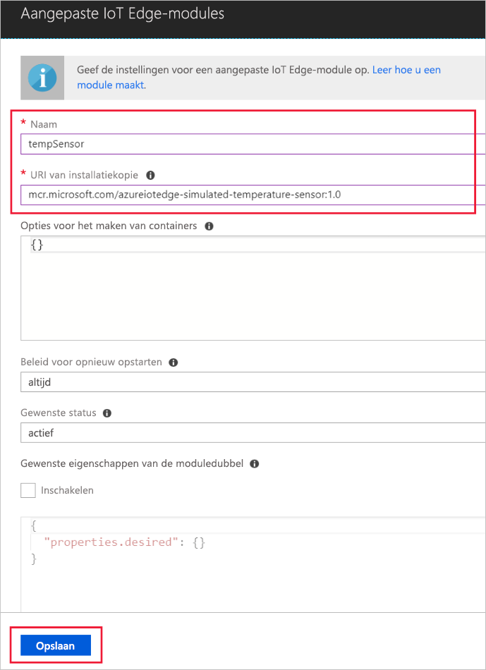

Een van de belangrijkste mogelijkheden van Azure IoT-rand wordt mogen modules implementeren voor uw IoT-randapparaten vanuit de cloud. Een IoT-Edge-module is een uitvoerbaar pakket geïmplementeerd als een container. In deze sectie maakt implementeren u een module die wordt gegenereerd telemetrie voor uw gesimuleerde apparaat. 

1. Navigeer naar uw IoT-hub in de Azure portal.
1. Ga naar **IoT rand (preview)** en selecteer het apparaat IoT rand.
1. Selecteer **Modules ingesteld**.
1. Selecteer **IoT rand Module toevoegen**.
1. In de **naam** veld `tempSensor`. 
1. In de **installatiekopie URI** veld `microsoft/azureiotedge-simulated-temperature-sensor:1.0-preview`. 
1. De andere instellingen ongewijzigd laat, en selecteer **opslaan**.

   

1. Terug in de **modules toevoegen** stap, selecteer **volgende**.
1. In de **routes opgeven** stap, selecteer **volgende**.
1. In de **template bekijken** stap, selecteer **indienen**.
1. Terug naar de detailpagina voor het apparaat en selecteer **vernieuwen**. Hier ziet u de nieuwe tempSensor module langs de rand van de IoT-runtime. 

   ![Weergave tempSensor in de lijst met geïmplementeerde modules][1]

<!-- Images -->
[1]: ../articles/iot-edge/media/tutorial-simulate-device-windows/view-module.png