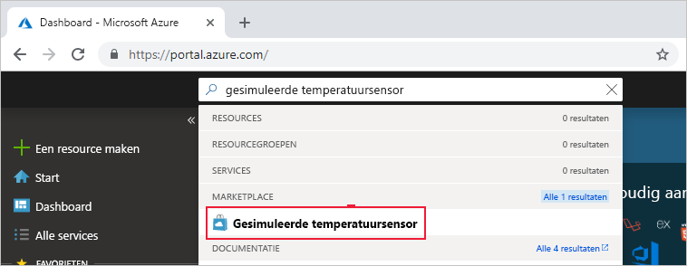
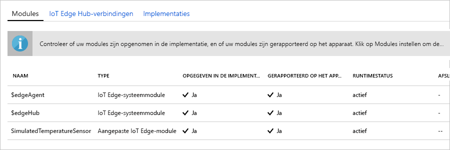

Een van de belangrijkste mogelijkheden van Azure IoT Edge is dat u er code voor uw IoT Edge-apparaten mee kunt implementeren vanuit de cloud. **IoT Edge-modules** zijn uitvoerbare pakketten die zijn geïmplementeerd als containers. In dit gedeelte implementeert u een vooraf samengestelde module vanuit de [sectie IoT Edge-modules van de Microsoft Azure Marketplace](https://azuremarketplace.microsoft.com/marketplace/apps/category/internet-of-things?page=1&subcategories=iot-edge-modules). 

De module die u in deze sectie implementeert, simuleert een sensor en verzendt gegenereerde gegevens. Deze module is een handig stukje code wanneer u aan de slag gaat met IoT Edge, omdat u de gesimuleerde gegevens kunt gebruiken voor ontwikkel- en testdoeleinden. Als u precies wilt zien wat deze module doet, kunt u de [broncode van de gesimuleerde temperatuursensor bekijken](https://github.com/Azure/iotedge/blob/027a509549a248647ed41ca7fe1dc508771c8123/edge-modules/SimulatedTemperatureSensor/src/Program.cs). 

Voer de volgende stappen uit als u uw eerste module vanuit de Microsoft Azure Marketplace wilt implementeren:

1. Voer in [Azure Portal](https://portal.azure.com) in het zoekvak **Gesimuleerde temperatuursensor** in en open het resultaat uit Marketplace.

   

2. Kies het IoT Edge-apparaat dat deze module moet ontvangen. Geef op de pagina **Doelapparaten voor IoT Edge-module** de volgende informatie op:

   1. **Abonnement:** selecteer het abonnement dat de IoT-hub bevat die u gebruikt.

   2. **IoT-hub**: selecteer de naam van de IoT-hub die u gebruikt.

   3. **Naam van IoT Edge-apparaat**: voer **myEdgeDevice** in als u de voorgestelde apparaatnaam al eerder in deze snelstartgids hebt gebruikt. Of selecteer **Apparaat kiezen** om een apparaat te kiezen uit een lijst met IoT Edge-apparaten in uw IoT Hub. 
   
   4. Selecteer **Maken**.

3. Nu u een IoT Edge-module in de Microsoft Azure Marketplace hebt gekozen en een IoT Edge-apparaat hebt geselecteerd dat de module moet ontvangen, gaat u verder naar een wizard met drie stappen om precies te definiëren hoe de module moet worden geïmplementeerd. In de wizardstap **Modules toevoegen** ziet u dat de module **SimulatedTemperatureSensor** automatisch wordt ingevuld. In de zelfstudies gebruikt u deze pagina om meer modules aan uw implementatie toe te voegen. In deze quickstart implementeert u alleen deze ene module. Selecteer **Volgende** om door te gaan naar de volgende stap van de wizard.

4. In de wizardstap **Routes opgeven** definieert u hoe berichten tussen modules en naar IoT Hub worden uitgewisseld. In deze snelstart wilt u dat alle berichten van alle modules naar de IoT Hub (`$upstream`) worden gestuurd. Als de gegevens niet automatisch worden ingevuld, voegt u de volgende code toe en selecteert u **Volgende**:

   ```json
    {
    "routes": {
        "route": "FROM /messages/* INTO $upstream"
        }
    }
   ```

5. In de wizardstap **Implementatie controleren** kunt u een preview bekijken van het JSON-bestand waarmee alle modules worden gedefinieerd die naar uw IoT Edge-apparaat worden geïmplementeerd. U ziet dat de module **SimulatedTemperatureSensor** hiervan deel uitmaakt, evenals twee extra systeemmodules **edgeAgent** en **edgeHub**. Selecteer **Indienen** wanneer u klaar bent met beoordelen.

   Wanneer u een nieuwe implementatie bij een IoT Edge-apparaat indient, wordt er niets naar uw apparaat gepusht. In plaats daarvan voert het apparaat regelmatig query’s uit naar eventuele nieuwe instructies. Als het apparaat een manifest van een bijgewerkte implementatie vindt, wordt de informatie over de nieuwe implementatie gebruikt om installatiekopieën van de module op te halen uit de cloud en wordt een lokale uitvoering van de modules gestart. Dit proces kan enkele minuten duren. 

6. Nadat u de informatie over de implementatie van de module hebt ingediend, keert u terug naar de pagina **IoT Edge**. Selecteer uw apparaat in de lijst met IoT Edge-apparaten om de details weer te geven. 

7. Blader op de pagina met apparaatdetails omlaag naar het gedeelte **Modules**. U ziet hier drie modules: $edgeAgent, $edgeHub en SimulatedTemperatureSensor. Als bij een of meer modules wordt vermeld dat ze worden geïmplementeerd maar niet per apparaat worden gerapporteerd, worden ze nog door uw IoT Edge-apparaat opgestart. Wacht enkele momenten en selecteer **Vernieuwen** bovenaan de pagina. 

   
