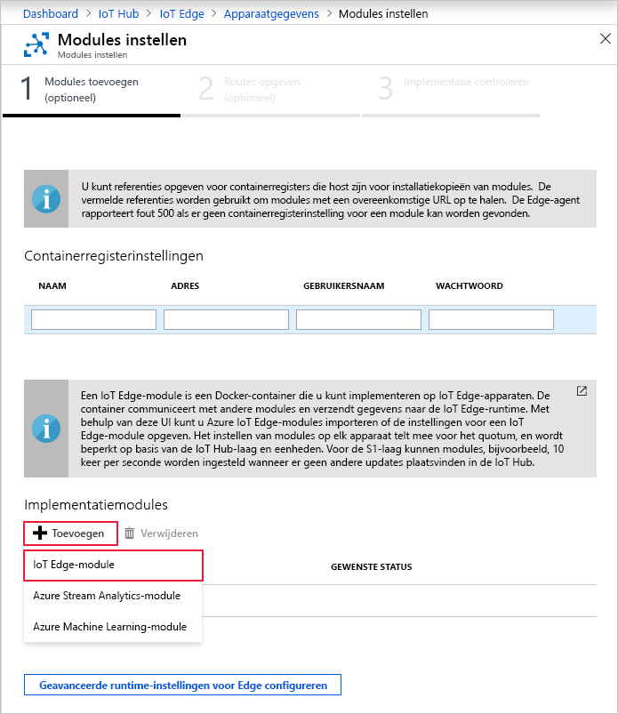

Een van de belangrijkste mogelijkheden van Azure IoT Edge is dat u er modules voor uw IoT Edge-apparaten mee kunt implementeren vanuit de cloud. Een IoT Edge-module is een uitvoerbaar pakket dat is geïmplementeerd als container. In deze sectie implementeert u een module die telemetrie genereert voor uw gesimuleerde apparaat.

1. Ga in Azure Portal naar uw IoT-hub.

2. Ga onder **Automatisch apparaatbeheer** naar **IoT Edge** en selecteer uw IoT Edge-apparaat.

3. Selecteer **Modules instellen**. In de portal wordt een wizard geopend die bestaat uit drie stappen. Deze helpen u bij het toevoegen van modules, het opgeven van routes en het beoordelen van de implementatie. 

4. Ga in de stap **Modules toevoegen** van de wizard naar de sectie **Implementatiemodules**. Klik op **Toevoegen** en selecteer vervolgens **IoT Edge-module**.

   

5. Voer in het veld **Naam** `tempSensor` in.

6. Voer in het veld **URI installatiekopie** `mcr.microsoft.com/azureiotedge-simulated-temperature-sensor:1.0` in.

7. Laat de overige instellingen ongewijzigd en selecteer **Opslaan**.

   

8. Als u weer in de eerste stap van de wizard bent, selecteert u **Volgende**.

9. In de stap **Routes opgeven** van de wizard moet u beschikken over een standaardroute waarmee alle berichten van alle modules worden verzonden naar IoT Hub. Voeg anders de volgende code toe en selecteer **Volgende**.

   ```json
   {
       "routes": {
           "route": "FROM /messages/* INTO $upstream"
       }
   }
   ```

10. Selecteer in de stap **Implementatie beoordelen** van de wizard de optie **Verzenden**.

11. Ga terug naar de detailpagina van het apparaat en selecteer **Vernieuwen**. Naast de module edgeAgent, die u hebt gemaakt toen u de service voor het eerst startte, ziet u een andere runtimemodule met de naam **edgeHub** en de module **tempSensor** in de lijst.

   Het kan enkele minuten duren voordat de nieuwe modules worden weergegeven. Op het IoT Edge-apparaat moeten de nieuw implementatiegegevens worden opgehaald uit de cloud, de containers worden gestart, en de nieuwe status weer worden gemeld bij IoT Hub. 

   
