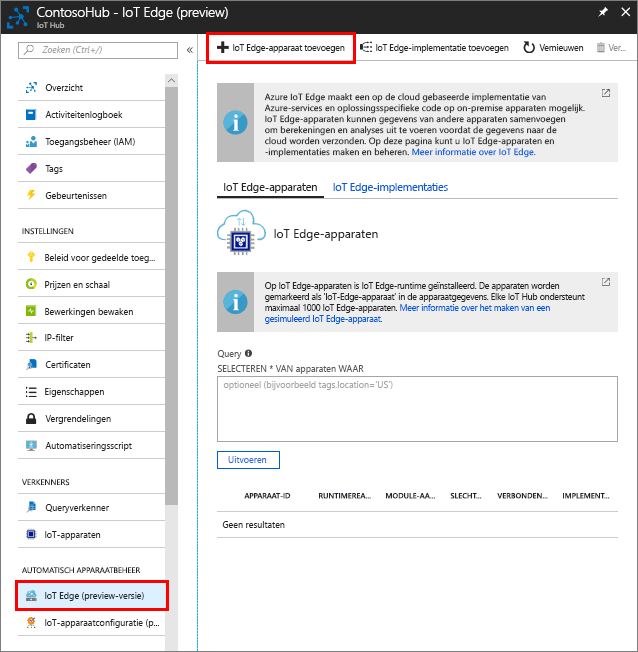

Maak een apparaat-id waarmee uw gesimuleerde apparaat kan communiceren met uw IoT-hub. Aangezien IoT Edge-apparaten zich gedragen en anders dan typische IoT-apparaten kunnen worden beheerd, kunt declareren u deze optie om te worden van een IoT-randapparaat vanaf het begin. 

1. Navigeer naar uw IoT-hub in de Azure portal.
1. Selecteer **IoT rand (preview)** Selecteer **IoT randapparaat toevoegen**.

   

1. Geef uw gesimuleerde apparaat een unieke apparaat-ID.
1. Selecteer **opslaan** apparaat toevoegen.
1. Selecteer het nieuwe apparaat in de lijst met apparaten.
1. Kopieer de waarde voor **verbindingsreeks: primaire sleutel** en op te slaan. U gebruikt deze waarde voor het configureren van de rand van de IoT-runtime in de volgende sectie. 

