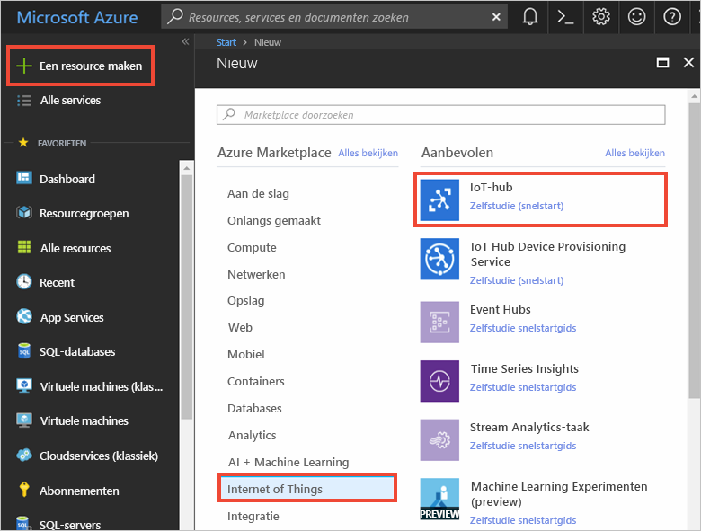
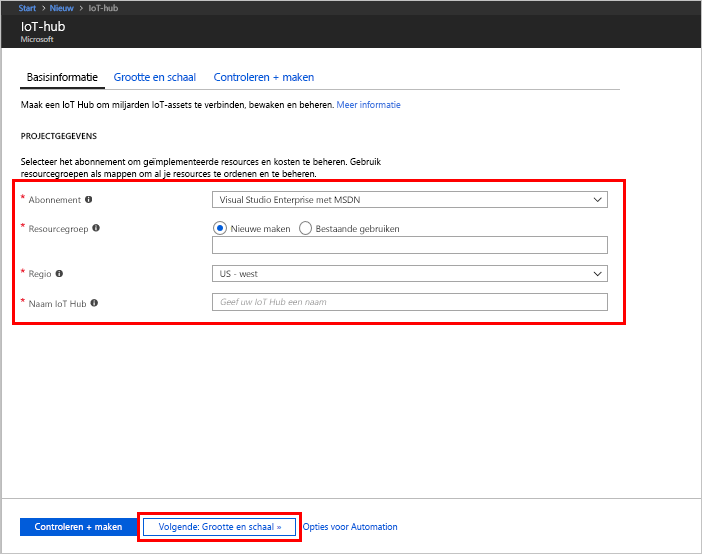
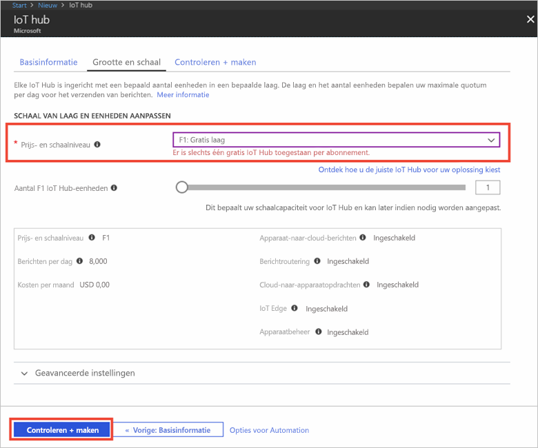

1. Meld u aan bij [Azure Portal](https://portal.azure.com/).

2. Selecteer **Een resource maken** > **Internet of Things** > **IoT Hub**.
   
    

3. Voer in het deelvenster **IoT Hub** deelvenster de volgende informatie in voor uw IoT-hub:

   * **Abonnement**: kies het abonnement dat u wilt gebruiken om deze IoT-hub te maken.

   * **Resourcegroep**: maak een resourcegroep voor het hosten van de IoT-hub of gebruik een bestaande. Zie [Resourcegroepen gebruiken om Azure-resources te beheren](../articles/azure-resource-manager/resource-group-portal.md) voor meer informatie.

   * **Regio**: selecteer de locatie die het dichtst bij u in de buurt is.

   * **Naam**: verzin een naam voor uw IoT-hub. Als de door u opgegeven naam beschikbaar is, verschijnt er een groen vinkje.

   [!INCLUDE [iot-hub-pii-note-naming-hub](iot-hub-pii-note-naming-hub.md)]

   

4. Selecteer **Volgende: grootte en schaal** om verder te gaan met het maken van uw IoT-hub. 

5. Kies uw **prijs- en schaalcategorie**. Selecteer voor dit artikel de categorie **F1 - Gratis** als deze nog beschikbaar is voor uw abonnement. Zie [Prijs- en schaalniveau](https://azure.microsoft.com/pricing/details/iot-hub/) voor meer informatie.

   

6. Selecteer **Controleren + maken**.

7. Controleer de informatie van uw IoT-hub en klik vervolgens op **Maken**. Het maken van de IoT-hub kan een paar minuten duren. U kunt de voortgang bewaken via het deelvenster **Meldingen**.