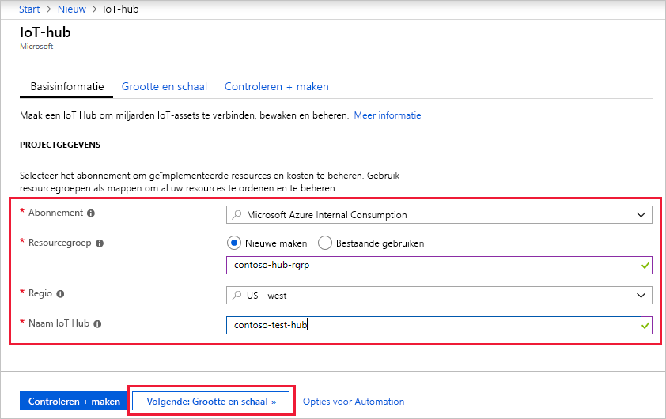
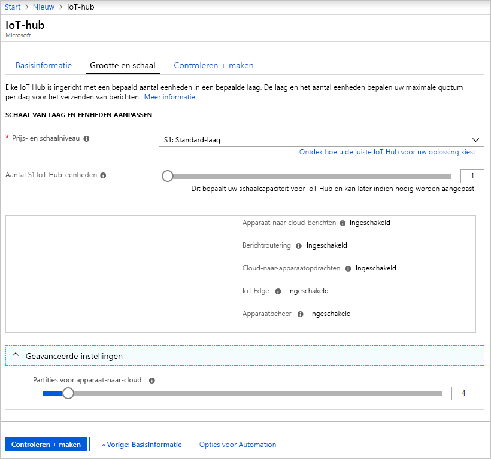
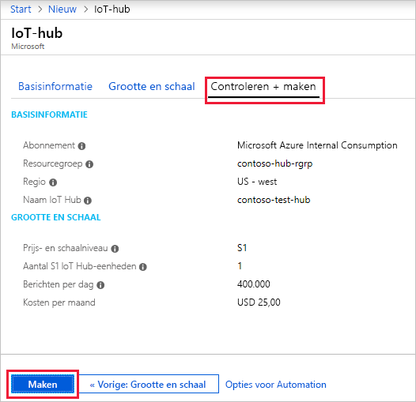

In deze sectie wordt beschreven hoe u een IoT-hub maakt met behulp van de [Azure-portal](https://portal.azure.com).

1. Meld u aan bij de [Azure-portal](https://portal.azure.com). 

2. Kies +**Een resource maken** en vervolgens **Internet of Things**.

3. Klik in de lijst rechts op **IoT Hub**. U krijgt het eerste scherm te zien om een IoT-hub te maken.

   

   Vul de velden in.

   **Abonnement**: selecteer het abonnement dat u voor de IoT-hub wilt gebruiken.

   **Resourcegroep**: u kunt een nieuwe resourcegroep maken of een bestaande selecteren. Als u een nieuwe wilt maken, klikt u op **Nieuwe maken** en vult u de gewenste naam in. Als u een bestaande resourcegroep wilt gebruiken, klikt u op **Bestaande gebruiken** en selecteert u de resourcegroep in de vervolgkeuzelijst. Zie [Resourcegroepen gebruiken om Azure-resources te beheren](../articles/azure-resource-manager/resource-group-portal.md) voor meer informatie.

   **Regio**: dit is de regio voor de locatie van uw hub. Selecteer in de vervolgkeuzelijst de locatie die het dichtst bij u in de buurt is.

   **Naam IoT-hub**: vul de naam voor de IoT-hub in. Deze naam moet wereldwijd uniek zijn. Als de door u opgegeven naam beschikbaar is, verschijnt er een groen vinkje.

   [!INCLUDE [iot-hub-pii-note-naming-hub](iot-hub-pii-note-naming-hub.md)]

4. Klik op **Volgende: grootte en schaal** om verder te gaan met het maken van uw IoT-hub.

   

   Op dit scherm kunt u de standaardwaarden gebruiken en onderaan op **Controleren en maken** klikken. 

   **Prijs- en schaalniveau**: u kunt kiezen uit diverse lagen, afhankelijk van hoeveel functies u wilt en hoeveel berichten u per dag wilt verzenden. De gratis optie is bedoeld voor testen en evalueren. Hiermee kunnen 500 apparaten met de IoT-hub worden verbonden en maximaal 8000 berichten per dag verzonden. Met de gratis optie kunt u voor elk Azure-abonnement één IoT Hub maken. 

   **IoT Hub-eenheden**: het aantal toegestane berichten per eenheid is afhankelijk van de prijscategorie van uw hub. Als u bijvoorbeeld wilt dat de IoT-hub de invoer van 700.000 berichten moet kunnen ondersteunen, dan kiest u twee S1-laageenheden.

   Zie [De juiste laag kiezen voor uw IoT-hub](../articles/iot-hub/iot-hub-scaling.md) voor informatie over andere opties.

   **Geavanceerde partities/Partities voor apparaat-naar-cloud**: met deze eigenschap worden de apparaat-naar-cloud-berichten gerelateerd met het aantal gelijktijdige lezers van de berichten. Voor de meeste IoT-hubs zijn slechts vier partities nodig. 

5. Klik op **Controleren en maken** om uw keuzes te beoordelen. U krijgt iets te zien wat lijkt op dit scherm.

   

6. Klik op **Maken** om de nieuwe IoT-hub te maken. De hub wordt binnen enkele minuten gemaakt.
