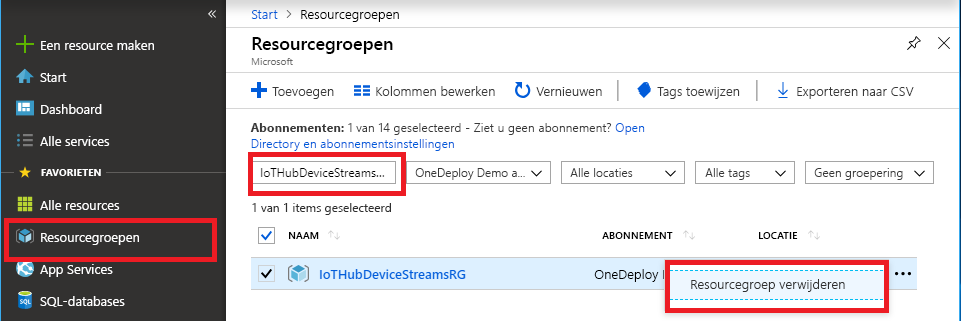

Als u van plan bent om door te gaan naar de volgende aanbevolen artikel, kunt u opslaan en opnieuw gebruiken van de resources die u al hebt gemaakt.

Anders, om kosten te voorkomen, kunt u de Azure-resources die u hebt gemaakt in dit artikel verwijderen.

> [!IMPORTANT]
> Het verwijderen van een resourcegroep kan niet ongedaan worden gemaakt. De resourcegroep en alle resources daarin worden permanent verwijderd. Zorg ervoor dat u niet per ongeluk de verkeerde resourcegroep of resources verwijdert. Als u hebt gemaakt met de IoT-hub in een bestaande resourcegroep met bronnen die u wilt behouden, verwijdert u alleen de IoT hub resource zelf, niet de resourcegroep.
>

Een resourcegroep verwijderen op naam:

1. Meld u aan bij [Azure Portal](https://portal.azure.com) en selecteer vervolgens **Resourcegroepen**.

1. In de **filteren op naam** voert u de naam van de resourcegroep waarin uw IoT-hub.

1. Selecteer in de lijst met resultaten, aan de rechterkant van de resourcegroep, het weglatingsteken ( **...** ), en selecteer vervolgens **resourcegroep verwijderen**.

    

1. Om te bevestigen dat de verwijdering van de resourcegroep, naam van de resourcegroep opnieuw en selecteer vervolgens **verwijderen**. Na een paar seconden, de resourcegroep en alle ingesloten bronnen verwijderd.
