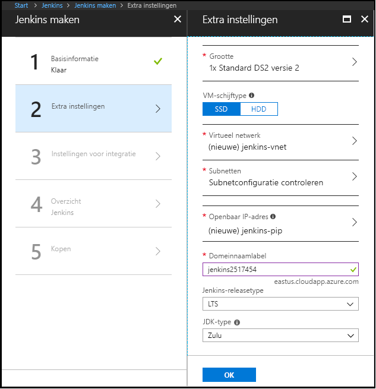

1. Open in uw browser de [Azure Marketplace-installatiekopie voor Jenkins](https://azuremarketplace.microsoft.com/marketplace/apps/azure-oss.jenkins?tab=Overview).

1. Selecteer **ophalen IT nu**.

    

1. Bekijk de informatie over de prijzen details en voorwaarden en selecteer **doorgaan**.

    

1. Selecteer **maken** de Jenkins-server configureren in de Azure portal. 

    

1. In de **basisbeginselen** tabblad, geeft u de volgende waarden:

    - **Naam** -Voer `Jenkins`.
    - **Gebruiker** -Geef de gebruikersnaam op voor gebruik bij het aanmelden bij de virtuele machine waarop Jenkins wordt uitgevoerd.
    - **Verificatietype** : Selecteer **wachtwoord**.
    - **Wachtwoord** -Voer het wachtwoord moet worden gebruikt bij het aanmelden bij de virtuele machine waarop Jenkins wordt uitgevoerd.
    - **Bevestig het wachtwoord** -Geef het wachtwoord moet worden gebruikt bij het aanmelden bij de virtuele machine waarop Jenkins wordt uitgevoerd opnieuw.
    - **Versietype Jenkins** : Selecteer **LTS**.
    - **Abonnement** -het Azure-abonnement waaraan u wilt installeren Jenkins selecteren.
    - **Resourcegroep** : Selecteer **nieuw**, en voer een naam voor de resourcegroep die fungeert als een logische container voor de verzameling van resources die gezamenlijk uw Jenkins-installatie.
    - **Locatie** : Selecteer **VS-Oost**.

    

1. Selecteer **OK** om door te gaan naar de **instellingen** tabblad. 

1. In de **instellingen** tabblad, geeft u de volgende waarden:

    - **De grootte van** -formaat van de juiste optie voor uw Jenkins virtuele machine.
    - **VM-schijftype** – Geef de harde schijf (harde schijf) of SSD (solid-state drive) om aan te geven welk type opslagschijf is toegestaan voor de Jenkins virtuele machine.
    - **Openbaar IP-adres** -naam van het IP-adres wordt standaard ingesteld op de Jenkins-naam die u hebt opgegeven in de vorige pagina en het achtervoegsel - IP. U kunt de optie die standaard wijzigen.
    - **Domeinnaamlabel** -Geef de waarde voor de volledige URL naar de Jenkins virtuele machine.

    

1. Selecteer **OK** om door te gaan naar de **samenvatting** tabblad.

1. Wanneer de **samenvatting** tabblad weergegeven, wordt de informatie hebt ingevoerd, wordt gevalideerd. Eenmaal u ziet de **validatie geslaagd** bericht, selecteer **OK**. 

    

1. Wanneer de **maken** tabblad worden weergegeven, selecteert u **maken** de Jenkins virtuele machine maken. Wanneer de server klaar is, wordt een melding weergegeven in de Azure portal.

    