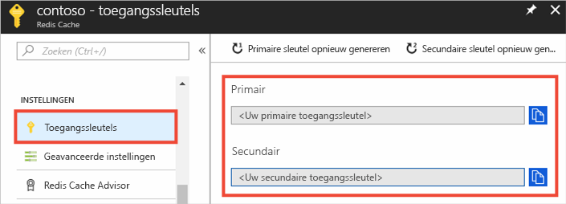
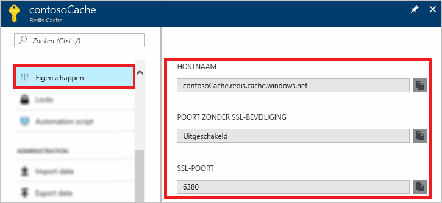

### Hostnaam, poorten en toegangssleutels ophalen met behulp van Azure Portal

Tijdens het verbinding maken met een Azure Redis Cache-instantie hebben de cache-clients de hostnaam, poorten en sleutels van de cache nodig. Sommige clients kunnen enigszins andere namen gebruiken om naar deze items te verwijzen. U kunt deze informatie ophalen in Azure Portal.

#### De toegangssleutels en hostnaam ophalen

1. Als u de toegangssleutels wilt ophalen met behulp van [Azure Portal](https://portal.azure.com), bladert u naar de cache en selecteert u **Toegangssleutels**. 

    

2. Selecteer **Eigenschappen** om de hostnaam en poorten op te halen.

    

