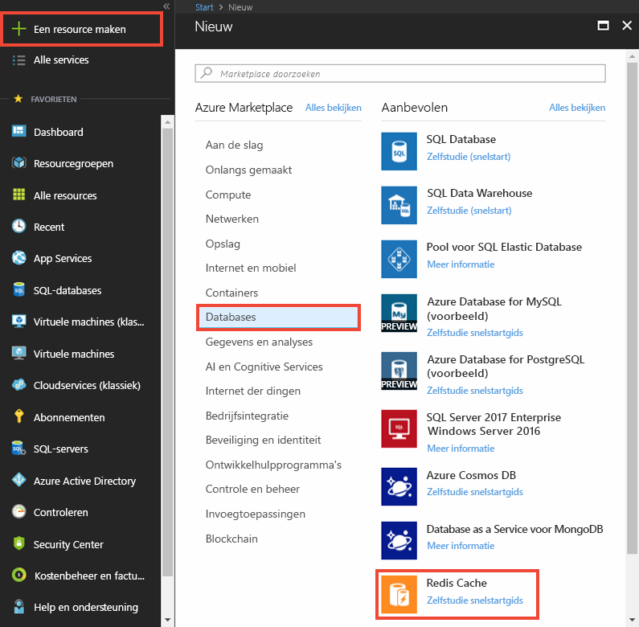
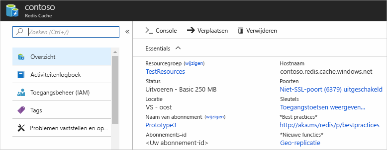

Als u een cache wilt maken, meldt u zich eerst aan bij [Azure Portal](https://portal.azure.com) en klikt u vervolgens op **Resource maken** > **Databases** > **Redis-cache**.

Configureer in **Nieuwe Redis-cache** de instellingen voor de nieuwe cache.

| Instelling      | Voorgestelde waarde  | Beschrijving |
| ------------ |  ------- | -------------------------------------------------- |
| **DNS-naam** | Wereldwijd unieke naam | De cachenaam is een tekenreeks van 1 tot 63 tekens die alleen cijfers, letters en het teken `-` mag bevatten. De cachenaam mag niet beginnen of eindigen met het teken `-`, en opeenvolgende `-`-tekens zijn niet toegestaan.  | 
| **Abonnement** | Uw abonnement | Het abonnement waarmee deze nieuwe Azure Redis-cache is gemaakt. | 
| **Resourcegroep** |  *TestResourceGroup* | Naam voor de nieuwe resourcegroep waarin de cache moet worden gemaakt. Door alle resources voor een app in een groep te plaatsen, kunt u ze samen beheren. Als u de resourcegroep verwijdert, worden bijvoorbeeld alle resources verwijderd die bij de app behoren. | 
| **Locatie** | VS - oost | Kies een [regio](https://azure.microsoft.com/regions/) vlakbij de andere services die gaan gebruikmaken van de cache. |
| **[Prijscategorie](https://azure.microsoft.com/pricing/details/cache/)** |  Basic C0 (250 MB Cache) |  De prijscategorie bepaalt de grootte, prestaties en functies die beschikbaar zijn voor de cache. Zie het [Azure Redis-cacheoverzicht](../articles/redis-cache/cache-overview.md) voor meer informatie. |
| **Vastmaken aan dashboard** |  Geselecteerd | Klik om de nieuwe cache vast te maken aan het dashboard, zodat u deze gemakkelijk kunt vinden. |

 

Klik op **Maken** wanneer de instellingen voor de nieuwe cache zijn geconfigureerd. 

Het kan enkele minuten duren voordat de cache is gemaakt. Als u de status wilt zien, kunt u de voortgang bekijken op het dashboard. Nadat de cache is gemaakt, heeft uw nieuwe cache de status **Wordt uitgevoerd** en is deze gereed voor gebruik.

