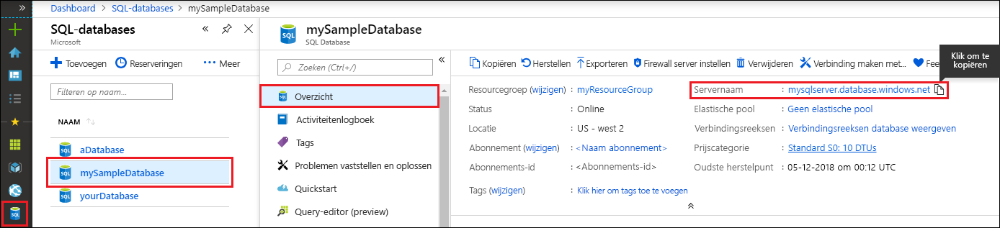

<!-- sql-database-connect-query-prerequisites-server-connection-info-includes.md 

## SQL server connection information
-->

Haal de verbindingsgegevens op die nodig zijn om verbinding te maken met de Azure SQL-database. U hebt de volledig gekwalificeerde servernaam, databasenaam en aanmeldingsgegevens in de volgende procedures nodig.

1. Meld u aan bij [Azure Portal](https://portal.azure.com/).

1. Selecteer **SQL-databases** in het menu links en klik op uw database op de pagina **SQL-databases**.

1. Op de pagina **Overzicht** voor de database controleert u de volledig gekwalificeerde servernaam zoals in de volgende afbeelding wordt weergegeven. U kunt de cursor boven de **servernaam** houden om de optie **Klik om te kopiëren** weer te geven.  

   

1. Als u de aanmeldingsgegevens voor de server bent vergeten, kunt u op **Servernaam** klikken om naar de SQL pagina **SQL-server** te gaan en de naam van de **Serverbeheerder** weer te geven. Selecteer indien nodig de optie **Wachtwoord opnieuw instellen**.
