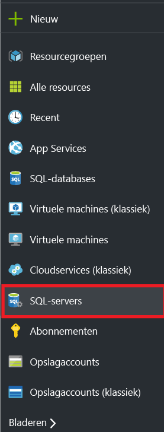
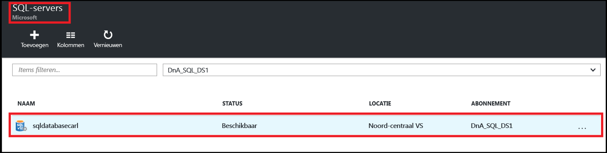
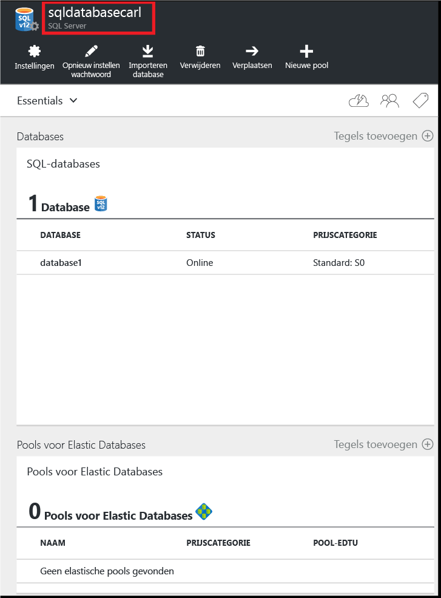
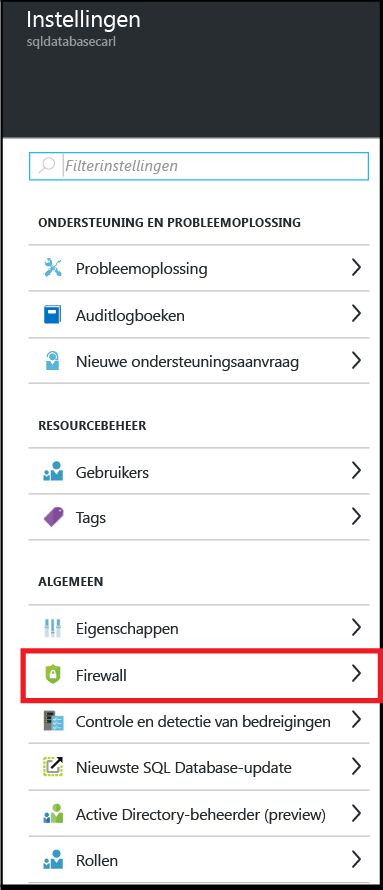
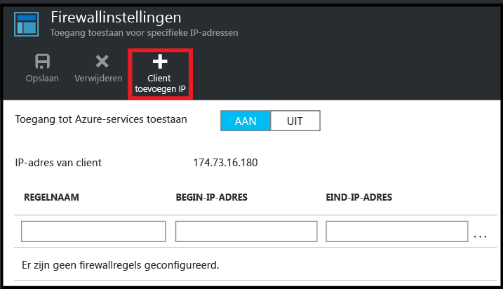
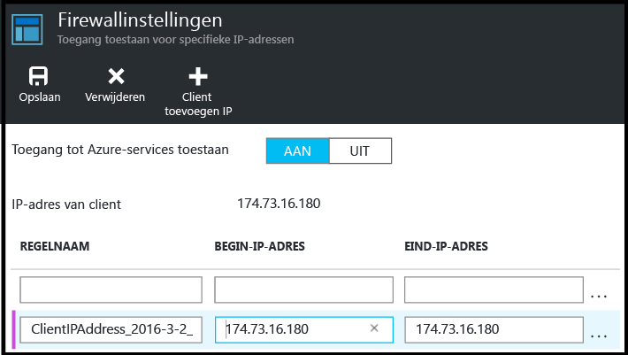
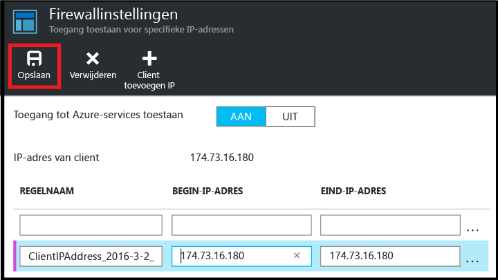

<!--
includes/sql-database-create-new-server-firewall-portal.md

Latest Freshness check:  2016-08-01 , rickbyh.

As of circa 2016-04-11, the following topics might include this include:
articles/sql-database/sql-database-get-started-tutorial.md
articles/sql-database/sql-database-configure-firewall-settings

-->
## Een nieuwe Azure SQL-firewall op serverniveau maken

Voer de volgende stappen uit in Azure Portal om een firewallregel op serverniveau te maken die verbindingen van een afzonderlijk IP-adres (de clientcomputer) of een IP-adresbereik naar een logische server met SQL Database toestaat.

1. Als u momenteel niet bent verbonden, maakt u eerst verbinding met [Azure Portal](http://portal.azure.com).
2. Klik in de standaardblade op **SQL-servers**.

    

3. Klik in de blade **SQL-servers** op de server waarop u de firewallregel wilt maken.

    

4. Bekijk de eigenschappen van uw server.

    

5. Klik in de blade **Instellingen** op **Firewall**.

    

    > [AZURE.NOTE] U kunt via de werkbalk van de blade **Database** ook toegang krijgen tot de blade **Firewallinstellingen** op serverniveau.

6. Klik op **Client-IP toevoegen** om in Azure een regel voor het IP-adres van de client te maken.

      

7. Klik desgewenst op het IP-adres dat is toegevoegd om het firewalladres zo te bewerken dat toegang is toegestaan tot een bereik van IP-adressen.

      

8. Klik op **Opslaan** om de firewallregel op serverniveau te maken.

     

    >[AZURE.IMPORTANT] Het IP-adres van de client kan van tijd tot tijd veranderen. Het is dan ook mogelijk dat u pas weer toegang hebt tot de server wanneer u een nieuwe firewallregel hebt gemaakt. U kunt uw IP-adres controleren met behulp van [Bing](http://www.bing.com/search?q=my%20ip%20address). Voeg vervolgens één IP-adres of een bereik van IP-adressen toe. Zie [Firewallinstellingen configureren](sql-database-configure-firewall-settings.md#manage-existing-server-level-firewall-rules-through-the-azure-portal) voor meer informatie.

<!--HONumber=sep14_HO2-->

