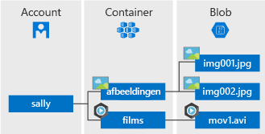

## Wat is Blob storage?
Azure Blob Storage is een service voor het opslaan van grote hoeveelheden ongestructureerde objectgegevens, zoals tekst of binaire gegevens, die via HTTP of HTTPS overal vandaan kunnen worden opgevraagd. U kunt Blob Storage gebruiken om gegevens openbaar te maken of om toepassingsgegevens privé op te slaan.

Veelvoorkomende toepassingen van Blob Storage zijn onder andere:

* Het leveren van afbeeldingen of documenten rechtstreeks naar een browser.
* Het opslaan van bestanden voor gedistribueerde toegang.
* Streaming van video en audio.
* Opslag van gegevens voor back-up en herstel, herstel na noodgevallen en archivering.
* Opslaan van gegevens voor analyse door een on-premises of Azure gehoste service.

## Concepten van Blob service
De Blob service bevat de volgende onderdelen:

* **Storage-account:** alle toegang tot Azure Storage vindt plaats via een opslagaccount. Dit opslagaccount mag een **algemeen opslagaccount** of een **Blob-opslagaccount**, dat speciaal is bedoeld voor het opslaan van objecten of blobs. Zie [Over Azure Storage-accounts](../articles/storage/common/storage-create-storage-account.md) voor meer informatie.
* **Container:** Een container is een groepering van een reeks blobs. Alle blobs moeten zich in een container bevinden. Een account kan een onbeperkt aantal containers bevatten. Een container kan een onbeperkt aantal blobs bevatten. De naam van een container mag alleen kleine letters bevatten.
* **Blob:** Een bestand van willekeurig type en willekeurige grootte. Azure Storage biedt drie typen blobs: blok-blobs, toevoeg-blobs en pagina-blobs.
  
    *Blok-blobs* zijn ideaal voor de opslag van tekst- of binaire bestanden, zoals documenten en mediabestanden. Eén blok-blob kan maximaal 50.000 blokken van maximaal 100 MB bevatten. Dat is in totaal iets meer dan 4.75 TB (100 MB x 50.000). 

    *Toevoeg-blobs* zijn vergelijkbaar met blok-blobs in dat opzicht dat ze bestaan uit blokken, maar ze zijn geoptimaliseerd voor toevoegbewerkingen; ze zijn daarom nuttig voor logboekscenario's. Eén toevoeg-blob kan maximaal 50.000 blokken van maximaal 4 MB bevatten. Dat is in totaal iets meer dan 195 GB (4 MB x 50.000).
  
    *Pagina-blobs* kunnen 1 TB groot zijn, en zijn efficiënter voor regelmatige lees- en schrijfbewerkingen. Virtuele Machines in Azure pagina-blobs gebruikt als het besturingssysteem en gegevensschijven.
  
    Zie voor meer informatie over de naamgeving van containers en blobs [Naming en verwijzen naar containers, blobs en metagegevens](/rest/api/storageservices/Naming-and-Referencing-Containers--Blobs--and-Metadata).

