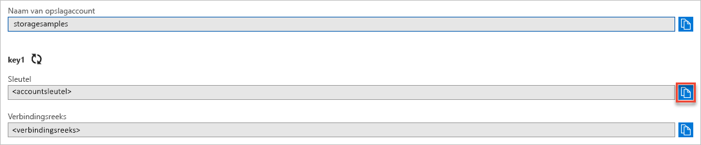

## Kopieer uw referenties van de Azure Portal

De voorbeeldtoepassing moet de toegang tot uw opslagaccount goedkeuren. U geeft de referenties voor uw opslagaccount aan de toepassing door in de vorm van een verbindingsreeks. Om uw opslagaccountreferenties te zien, doet u het volgende:

1. Navigeer naar [Azure Portal](https://portal.azure.com).
2. Zoek uw opslagaccount.
3. In de sectie **Instellingen** van het overzicht met opslagaccounts selecteert u **Toegangssleutels**. De toegangssleutels van uw account en de verbindingsreeks worden weergegeven.
4. Noteer de naam van uw opslagaccount. U hebt deze nodig voor de autorisatie.   
5. Zoek de waarde van de **Sleutel** onder **key1** en klik op de knop **Kopiëren** om de accountsleutel te kopiëren.

    
