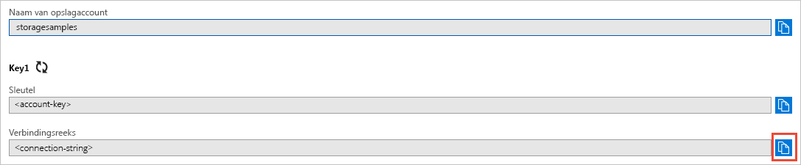

## Kopieer uw referenties van de Azure Portal

De voorbeeldtoepassing moet de toegang tot uw opslagaccount verifiëren. Om te verifiëren voegt u de referenties van uw opslagaccount als een verbindingsreeks aan de toepassing toe. U kunt de referenties van het opslagaccount weergeven door de volgende stappen te volgen:

1. Navigeer naar [Azure Portal](https://portal.azure.com).
2. Zoek uw opslagaccount.
3. In de sectie **Instellingen** van het overzicht met opslagaccounts selecteert u **Toegangssleutels**. Hier worden de toegangssleutels van uw account weergegeven, evenals de volledige verbindingsreeks voor elke sleutel.   
4. Zoek de waarde van de **Verbindingsreeks** onder **key1** en selecteer de knop **Kopiëren** om de verbindingsreeks te kopiëren. U gaat in de volgende stap de waarde voor de verbinding toevoegen aan een omgevingsvariabele.

    
