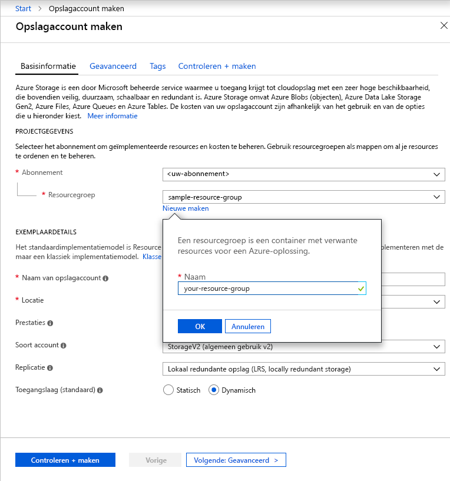

Als u een v2-opslagaccount voor algemeen gebruik wilt maken in de Azure Portal, volgt u deze stappen:

1. Vouw in Azure Portal het menu links open om het menu met services te openen en kies **Alle services**. Schuif vervolgens omlaag naar **Opslag** en kies **Opslagaccounts**. Kies in het venster **Opslagaccounts** dat wordt weergegeven de optie **Toevoegen**.
1. Selecteer het abonnement waarin u het opslagaccount wilt maken.
1. Onder het veld **Resourcegroep** klikt u op **Nieuw**. Voer een naam in voor de nieuwe resourcegroep, zoals in de volgende afbeelding wordt weergegeven.

    

1. Voer vervolgens een naam in voor het opslagaccount. De naam die u kiest, moet uniek zijn in Azure, moet tussen de 3 en 24 tekens lang zijn en mag alleen cijfers en kleine letters bevatten.
1. Selecteer een locatie voor uw opslagaccount of gebruik de standaardlocatie.
1. Laat deze velden ingesteld staan op de standaardwaarden:
    - Het veld **Implementatiemodel** is standaard ingesteld op **Resource Manager**.
    - Het veld **Prestaties** is standaard ingesteld op **Standaard**.
    - Het veld **Soort account** is standaard ingesteld op **StorageV2 (algemeen gebruik v2)**.
    - Het veld **Replicatie** is standaard ingesteld op **Lokaal redundante opslag (LRS)**.
    - De **toegangslaag** is standaard ingesteld op **Dynamisch**.

1. Klik op **Beoordelen en maken** om uw opslagaccountinstellingen te bekijken en het account te maken.
1. Klik op **Create**.

Zie [Azure-opslagaccountoverzicht](https://docs.microsoft.com/azure/storage/common/storage-account-overview) voor meer informatie over typen opslagaccounts en andere opslagaccountinstellingen. Zie [Azure Resource Manager overview](https://docs.microsoft.com/azure/azure-resource-manager/resource-group-overview) (Overzicht van Azure Resource Manager) voor meer informatie over resourcegroepen. 
