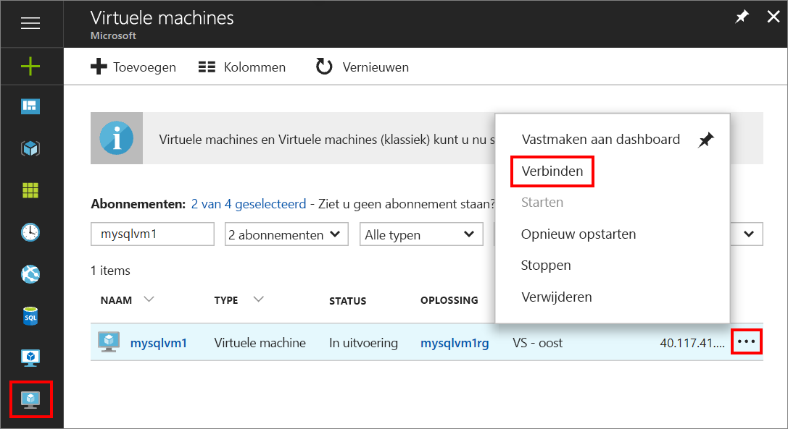
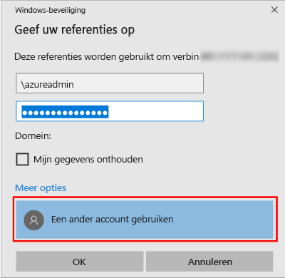

1. Wanneer de virtuele Azure-machine is gemaakt en wordt uitgevoerd, klikt u in Azure Portal op het pictogram Virtuele machines om uw VM's te bekijken.

1. Klik op het beletselteken (**...**) voor de nieuwe virtuele machine.

1. Klik op **Verbinden**.

   

1. Open het **RDP**-bestand dat in de browser is gedownload voor de VM.

1. Verbinding met extern bureaublad meldt dat de uitgever van deze externe verbinding niet kan worden geïdentificeerd. Klik op **Verbinden** om door te gaan.

1. Klik in het dialoogvenster **Windows-beveiliging** op **Een ander account gebruiken**. Mogelijk moet u op **Meer opties** klikken om de optie weer te geven. Geef de gebruikersnaam en het wachtwoord op die u hebt geconfigureerd tijdens het maken van de VM. U moet een backslash toevoegen voor de gebruikersnaam.

   

1. Klik op **OK** om verbinding te maken.
